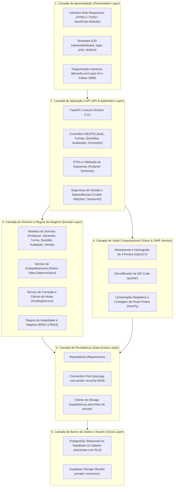
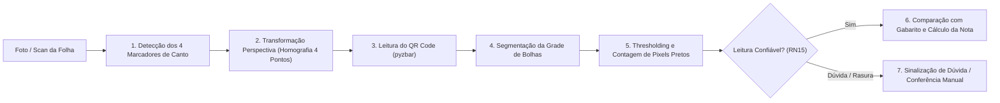
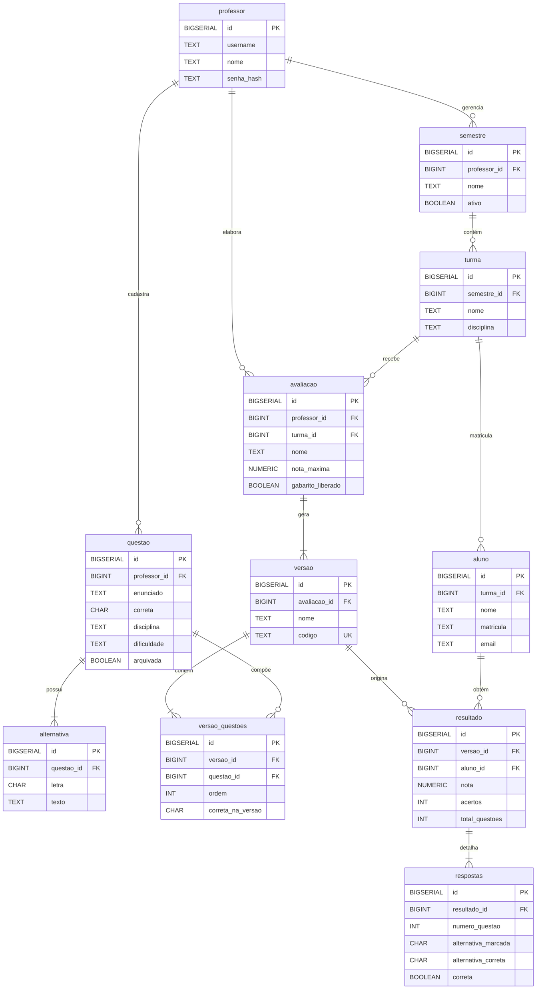
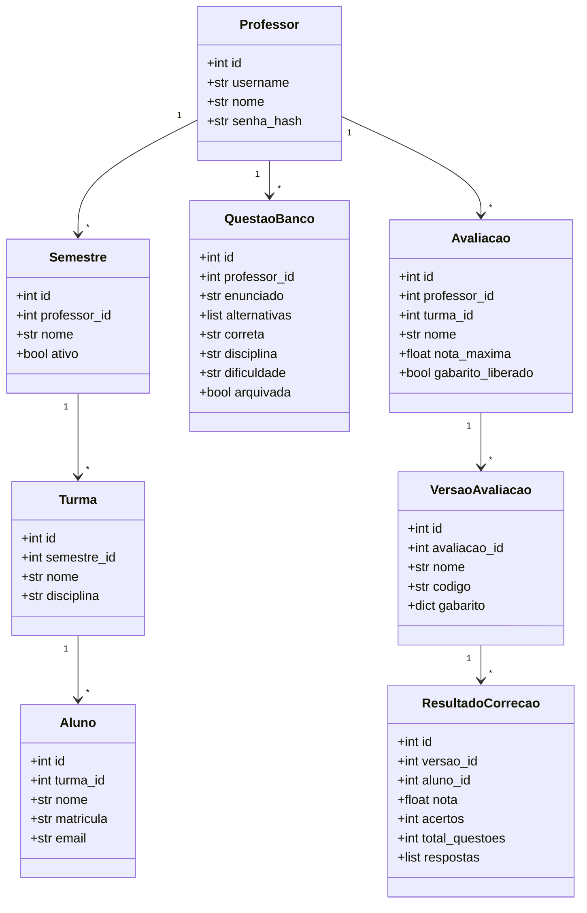

# 🎓 AvaliaSystem — Sistema de Geração e Correção Automática de Avaliações

> **Repositório Oficial** de desenvolvimento do projeto prático da disciplina de **Projeto e Arquitetura de Software**.  
> **Entrega da Fase N2 — Versão v2 Oficial com Supabase e OMR** (Atendimento integral ao **Critério C3** da N2).

---

## 📑 Sumário

1. [Visão Geral e Proposta de Valor](#-visão-geral-e-proposta-de-valor)
2. [Equipe e Responsabilidades Oficiais](#-equipe-e-responsabilidades-oficiais)
3. [Diferenciais e Evolução da Fase N2](#-diferenciais-e-evolução-da-fase-n2)
4. [Arquitetura em Camadas (Layered Architecture)](#-arquitetura-em-camadas-layered-architecture)
5. [Processamento Digital de Imagens e Correção Automática (OMR)](#-processamento-digital-de-imagens-e-correção-automática-omr)
6. [Modelagem do Banco de Dados (Supabase / PostgreSQL)](#-modelagem-do-banco-de-dados-supabase--postgresql)
7. [Diagramas Oficiais do Sistema (MER, DER e UML v2)](#-diagramas-oficiais-do-sistema-mer-der-e-uml-v2)
8. [Variáveis de Ambiente (.env)](#-variáveis-de-ambiente-env)
9. [Guia de Execução Local (Modo Persistente e Modo Mock)](#-guia-de-execução-local-modo-persistente-e-modo-mock)
10. [Deploy em Nuvem e Produção](#-deploy-em-nuvem-e-produção)
11. [Rotas e Contratos da API REST](#-rotas-e-contratos-da-api-rest)
12. [Organização do Repositório e Governança](#-organização-do-repositório-e-governança)

---

## 🌟 Visão Geral e Proposta de Valor

O **AvaliaSystem** é uma plataforma acadêmica corporativa desenvolvida para resolver as principais dores do processo avaliativo presencial no ensino superior e na educação básica. O sistema integra a elaboração de provas, diagramação automática, prevenção a fraudes por meio de versões com questões embaralhadas, impressão padronizada em folha A4 e **correção automatizada via Visão Computacional / OMR (Optical Mark Recognition)** a partir de fotos tiradas por smartphone.

### Ciclo Completo de Valor:
- **Gestão Acadêmica Unificada:** Semestres letivos, turmas, alunos e repositório centralizado de questões classificadas por disciplina e dificuldade.
- **Geração Inteligente de Provas:** Montagem assistida com criação de múltiplas versões (A, B, C...) com embaralhamento determinístico de enunciados e alternativas.
- **Folhas de Resposta com QR Code e Âncoras Ópticas:** Cada estudante recebe uma folha com marcadores nos 4 cantos e um QR Code único para leitura e rastreabilidade total.
- **Correção Automática por Foto/Scan:** O professor fotografa a folha de respostas e o motor de visão computacional em **OpenCV** e **Pyzbar** alinha a imagem, decodifica o QR Code, segmenta as bolhas preenchidas e calcula a nota em segundos.
- **Portal do Aluno:** Consulta pública do gabarito da sua versão específica via leitura do QR Code com liberação controlada pelo professor.
- **Relatórios Analíticos e Exportação:** Estatísticas de aproveitamento por turma, discriminador de erros por questão e exportação de notas em **Excel (.xlsx)** e CSV.

---

## 👥 Equipe e Responsabilidades Oficiais

| Integrante | Atribuição | Responsabilidades Oficiais |
| :--- | :--- | :--- |
| **Gabriel Koehler da Silva** | **Front-end, Mocks & Navegação** | Desenvolvimento de todas as interfaces web navegáveis no padrão *AvaliaSystem* (N1/N2), usabilidade, responsividade, integração com a API REST Python e telas de correção/relatórios (N2), além da estruturação do repositório/Kanban (`[N1-INF-03]`) e do provedor mock state (`[N1-BE-02]`). |
| **Luan Eliseu** | **Back-end & Banco de Dados** | Desenvolvimento da API REST em Python (FastAPI), módulo de Visão Computacional / OMR via OpenCV (`cv2`) e pyzbar, integração com Supabase (`supabase-py`), regras de embaralhamento e gabaritos, CRUDs relacionais e exportação de relatórios. |
| **ALYSON DE LIMA DE OLIVEIRA** | **Documentação & Arquitetura** | Esboço inicial das classes de domínio, elaboração dos READMEs oficiais (v1 para N1 e v2 para N2), documentação formal da arquitetura em camadas e registros de decisões técnicas (ADRs). |
| **ELOISA FAZZIO DA SILVA ROCHA** | **Requisitos, Fluxos & Modelagem Conceitual** | Mapeamento completo dos fluxos de navegação e casos de uso, elaboração do roteiro de testes navegáveis de aceitação (N1), Modelagem Conceitual (MER) e Dicionário de Dados para o banco de dados (N2). |
| **DIEGO RAFAEL DA SILVA DORNELLES** | **Infraestrutura, Deploy & Modelagem Física** | Configuração de deploy contínuo em nuvem (Render/Vercel), automação do pacote de entrega C1 (.zip limpo), provisionamento do Supabase, DER Físico, scripts DDL/Seed (`schema.sql` e `seed.sql`) e Diagrama de Classes UML v2. |

---

## 🚀 Diferenciais e Evolução da Fase N2

Na transição da Fase N1 para a **Fase N2**, o sistema evoluiu do estágio de protótipo navegável em memória para um sistema de produção robusto e persistente:

1. **Persistência Relacional Real:** Substituição do mock em memória pelo banco de dados relacional **PostgreSQL** hospedado em nuvem no **Supabase**, com transações ACID, integridade referencial e isolamento por professor.
2. **Motor de Visão Computacional / OMR:** Processamento digital de imagem real utilizando **OpenCV (`cv2`)** e **pyzbar**, tolerante a variações de iluminação, sombras, fotos inclinadas, rotação de 180° e fotos tiradas por smartphone.
3. **Auditoria com Armazenamento em Nuvem:** As fotos das folhas corrigidas são salvas no **Supabase Storage** (bucket privado), permitindo auditoria visual direta na tela de resultados.
4. **Exportação de Relatórios em Excel (.xlsx):** Geração automática de planilhas formatadas contendo notas consolidadas, detalhamento por questão e resumo de desempenho.
5. **Decisões Técnicas Registradas (ADRs):** Justificativas formais para as escolhas de OpenCV, Supabase e FastAPI documentadas no repositório.

---

## 🏛️ Arquitetura em Camadas (Layered Architecture)

O AvaliaSystem foi projetado seguindo rigorosamente o **Padrão de Arquitetura em Camadas**, garantindo alta coesão, separação estrita de responsabilidades (*Separation of Concerns*) e baixo acoplamento.

Consulte a documentação completa em: [`docs/arquitetura/arquitetura-em-camadas.md`](docs/arquitetura/arquitetura-em-camadas.md)  
Registros de Decisões de Arquitetura: [`docs/arquitetura/adr/`](docs/arquitetura/adr/)



### Decisões Arquiteturais Chave (ADRs):
* **[ADR-0001](docs/arquitetura/adr/0001-escolha-python-opencv-omr.md):** Escolha de Python 3.11, OpenCV e Pyzbar para o motor OMR (elimina custo de OCR proprietário e garante processamento local rápido).
* **[ADR-0002](docs/arquitetura/adr/0002-escolha-supabase-postgresql-storage.md):** Escolha do Supabase (PostgreSQL Cloud com suporte a pooler e Storage unificado para imagens de auditoria).
* **[ADR-0003](docs/arquitetura/adr/0003-arquitetura-em-camadas-fastapi.md):** Adoção de FastAPI com Arquitetura em Camadas (tipagem estática via Pydantic, OpenAPI/Swagger automático e alta performance assíncrona).

---

## 📷 Processamento Digital de Imagens e Correção Automática (OMR)

A leitura das folhas de resposta é realizada por um pipeline de processamento digital de imagem desenhado para tolerar condições reais de digitalização via celular:



### Especificações Técnicas do OMR:
1. **Marcadores de Enquadramento:** Quatro quadrados sólidos nos cantos da folha de respostas A4 atuam como âncoras para correção geométrica de rotação, inclinação e escala.
2. **Identificação da Prova:** O QR Code no canto superior direito é decodificado via `pyzbar`, recuperando a avaliação, a versão exata da prova e a ordem original das questões.
3. **Classificação de Marcações:** A intensidade média e a densidade de pixels no interior de cada círculo determinam:
   - Alternativa assinalada única (ex.: `"A"`, `"B"`...)
   - Em branco (`null`)
   - Marcação múltipla / rasura anulada (`"*"`)
4. **Regra de Cálculo de Notas (RF38):**
   $$\text{Nota} = \left(\frac{\text{Total de Acertos}}{\text{Total de Questões}}\right) \times \text{Nota Máxima}$$
   *Questões em branco ou anuladas recebem zero ponto.*
5. **Auditoria e Segurança (RN15):** Em caso de marcação fraca ou rasura ambígua, o sistema rejeita a gravação automática silenciosa, exibe a imagem destacada e solicita confirmação visual do professor.

---

## 🗄️ Modelagem do Banco de Dados (Supabase / PostgreSQL)

O modelo de dados suporta o ciclo completo das avaliações com integridade referencial e isolamento estrito entre professores:

* **Script DDL Oficial:** [`src/database/schema.sql`](src/database/schema.sql) e [`app/database/schema.sql`](app/database/schema.sql)
* **Script de Dados Iniciais (Seed):** [`src/database/seed.sql`](src/database/seed.sql)
* **Dicionário de Dados:** [`docs/banco-de-dados/dicionario-de-dados.md`](docs/banco-de-dados/dicionario-de-dados.md)

### Tabelas do Sistema:
1. `professores`: Usuários docentes autenticados no sistema.
2. `semestres`: Períodos letivos vinculados a um professor.
3. `turmas`: Turmas de disciplinas associadas a um semestre.
4. `alunos`: Estudantes matriculados nas turmas.
5. `questoes`: Banco de itens avaliativos com enunciados e metadados.
6. `alternativas`: Opções de resposta vinculadas a cada questão.
7. `avaliacoes`: Avaliações configuradas pelo professor (com nota máxima e status de liberação do gabarito).
8. `versoes`: Versões específicas geradas para a avaliação (ex.: Versão A, B, C) com código único de QR Code.
9. `versao_questoes`: Mapeamento determinístico da ordem das questões e letras de alternativas para cada versão.
10. `resultados`: Registro da correção por aluno (nota final, total de acertos, erros e data).
11. `respostas`: Alternativa assinalada pelo aluno em cada questão corrigida.

---

## 📊 Diagramas Oficiais do Sistema (MER, DER e UML v2)

### 1. Diagrama Entidade-Relacionamento (DER Físico)

Consulte o documento completo em: [`docs/arquitetura/der-fisico-n2.md`](docs/arquitetura/der-fisico-n2.md)



---

### 2. Diagrama de Classes UML v2

Consulte o documento completo em: [`docs/arquitetura/diagrama-classes-uml-v2.md`](docs/arquitetura/diagrama-classes-uml-v2.md)



---

## 🔐 Variáveis de Ambiente (.env)

O sistema utiliza o arquivo `.env` para configuração segura. Utilize o modelo versionado [`.env.example`](.env.example) como referência:

| Variável | Obrigatória | Finalidade e Descrição |
| :--- | :---: | :--- |
| `SECRET_KEY` | **Sim** | Chave criptográfica para assinatura de cookies de sessão docente. |
| `DATABASE_URL` | **Sim** (N2) | Connection string do PostgreSQL do Supabase (utilizar pooler na porta 6543 em produção). |
| `SUPABASE_URL` | Opcional | URL base do projeto Supabase para comunicação com a API de Storage. |
| `SUPABASE_KEY` | Opcional | Service Role Key ou anon key autorizada para o upload de fotos de provas. |
| `SUPABASE_BUCKET` | Opcional | Nome do bucket privado para fotos corrigidas (padrão: `correcoes`). |
| `SESSION_HTTPS_ONLY` | Produção | `true` em produção (força flag Secure no cookie); `false` em desenvolvimento local. |
| `PUBLIC_BASE_URL` | Produção | Domínio público oficial utilizado na geração dos QR Codes (ex.: `https://projetosgp.onrender.com`). |
| `CORS_ORIGINS` | Opcional | Origens autorizadas para chamadas cross-origin separadas por vírgula. |
| `PROFESSOR_USERNAME` | Demo | Usuário inicial para ambiente de testes (padrão: `professor`). |
| `PROFESSOR_PASSWORD` | Demo | Senha inicial para ambiente de testes (padrão: `123456`). |
| `PROFESSOR_NOME` | Demo | Nome exibido na interface para a conta demo. |
| `TEST_DATABASE_URL` | Testes | Connection string exclusiva para execução da suíte de testes de integração descartável. |

---

## ⚙️ Guia de Execução Local (Modo Persistente e Modo Mock)

### Pré-requisitos
- **Python 3.11** ou superior
- **Node.js 18** ou superior
- **Git**

### 1. Preparação do Ambiente

```bash
# Clonar o repositório
git clone https://github.com/gabriel-Koehler/projetosgp.git
cd projetosgp

# Criar e ativar o ambiente virtual Python
python -m venv .venv
.\.venv\Scripts\Activate.ps1    # Linux/macOS: source .venv/bin/activate

# Instalar dependências completas
pip install -r requirements-dev.txt
npm install

# Configurar variáveis de ambiente
copy .env.example .env          # Linux/macOS: cp .env.example .env
```

### 2. Execução com Persistência Real no Supabase / PostgreSQL (Modo N2)

1. Preencha `DATABASE_URL` no seu arquivo `.env` com os dados do PostgreSQL.
2. Execute a migração para criar as tabelas e o usuário inicial:
   ```bash
   python -m app.database.migrate
   ```
3. Verifique a integridade da conexão:
   ```bash
   python -m app.database.check
   ```
4. Inicie o sistema integrado no modo real:
   ```bash
   npm run dev:real
   ```
   * Aplicação Web: [http://localhost:3000](http://localhost:3000)
   * Documentação Swagger da API: [http://localhost:8000/docs](http://localhost:8000/docs)

### 3. Execução em Modo Mock / Demonstração (Modo N1)

Para executar sem necessidade de configurar banco de dados externo:
```bash
npm run dev:all
```

---

## 🌐 Deploy em Nuvem e Produção

O AvaliaSystem foi homologado para implantação em plataformas gratuitas de computação em nuvem:

* **Endereço de Demonstração em Produção:** [https://projetosgp.onrender.com](https://projetosgp.onrender.com)
* **Especificação de Infraestrutura:** Manifesto [`render.yaml`](render.yaml) configurado com healthcheck em `/health`.

### Execução via Docker em Produção
```bash
docker build -t avaliasystem-n2 .
docker run --rm -p 3000:3000 --env-file .env avaliasystem-n2
```

---

## 📡 Rotas e Contratos da API REST

A API FastAPI disponibiliza endpoints estruturados para todos os módulos:

| Método | Endpoint | Autenticado | Descrição da Operação |
| :---: | :--- | :---: | :--- |
| `GET` | `/api/health` | — | Verificação de integridade operacional (healthcheck). |
| `POST` | `/api/auth/login` | — | Autenticação do professor e criação de cookie de sessão. |
| `POST` | `/api/auth/logout` | — | Encerramento de sessão. |
| `GET` | `/api/auth/me` | ✅ | Dados do professor autenticado. |
| `GET` / `POST` | `/api/semestres` | ✅ | Listagem e cadastro de semestres letivos. |
| `GET` / `PUT` | `/api/semestres/{id}` | ✅ | Consulta e edição de semestre. |
| `GET` / `POST` | `/api/turmas` | ✅ | Listagem e criação de turmas. |
| `GET` / `POST` | `/api/turmas/{id}/alunos` | ✅ | Consulta e inclusão de alunos na turma. |
| `POST` | `/api/turmas/{id}/alunos/importar` | ✅ | Carga de alunos via planilha CSV/XLSX. |
| `GET` / `POST` | `/api/questoes` | ✅ | Consulta paginada com filtros e cadastro de questões. |
| `POST` | `/api/questoes/importar` | ✅ | Importação de questões por planilha com prévia e confirmação. |
| `POST` | `/api/avaliacoes` | ✅ | Geração transacional de avaliações, versões e gabaritos. |
| `GET` | `/api/avaliacoes` | ✅ | Listagem de avaliações cadastradas. |
| `PATCH` | `/api/avaliacoes/{id}/gabarito` | ✅ | Liberação ou bloqueio do gabarito para os alunos. |
| `GET` | `/api/avaliacoes/{id}/versoes/{codigo}/folha.pdf` | ✅ | Folha de respostas A4 oficial com QR Code e marcadores. |
| `POST` | `/api/correcoes/leitura` | ✅ | Leitura óptica da foto da folha sem registro de nota. |
| `POST` | `/api/correcoes` | ✅ | Correção automática via OMR e persistência da nota do aluno. |
| `POST` | `/api/correcoes/manual` | ✅ | Registro de conferência manual de respostas pelo professor. |
| `GET` | `/api/avaliacoes/{id}/resultados` | ✅ | Consulta de notas e respostas de todos os alunos. |
| `GET` | `/api/avaliacoes/{id}/estatisticas` | ✅ | Estatísticas de rendimento da turma e discriminação por questão. |
| `GET` | `/api/avaliacoes/{id}/resultados.xlsx` | ✅ | Exportação do relatório oficial consolidado em Excel. |
| `GET` | `/student/gabarito/{codigo}` | — | Portal público do aluno para visualização do gabarito liberado. |

---

## 📁 Organização do Repositório e Governança

```
projetosgp/
├── .github/                       # Configurações do GitHub e templates de issues
├── app/                           # Back-end em Python (FastAPI modular)
│   ├── controllers/               # Controladores HTTP e tratamento de requisições
│   ├── core/                      # Configurações de ambiente, segurança e sessões
│   ├── database/                  # Migrações, checks e conexão com PostgreSQL
│   ├── models/                    # Entidades do domínio
│   ├── repositories/              # Camada de persistência e acesso ao banco
│   ├── schemas/                   # Esquemas Pydantic para validação JSON
│   ├── services/                  # Regras de negócio (embaralhamento, QR, OMR)
│   └── main.py                    # Aplicação principal FastAPI
├── docs/                          # Documentação oficial completa
│   ├── arquitetura/               # Arquitetura em camadas, ADRs, DER físico e UML v2
│   ├── banco-de-dados/            # Dicionário de dados e regras de integridade
│   ├── infra/                     # Auditoria, planos de deploy e validação Supabase
│   ├── n2-parte1/                 # Diagramas de caso de uso, atividade e sequência
│   ├── requisitos/                # Fluxos de usuário e mapeamento funcional
│   ├── testes/                    # Roteiros e evidências de testes
│   ├── ACOMPANHAMENTO_ISSUES_GABRIEL.md # Registro oficial das entregas
│   ├── KANBAN_BOARD.md            # Quadro Kanban do projeto
│   └── PROJECT_BACKLOG.md         # Backlog técnico com critérios de aceite
├── public/                        # Frontend cliente, scripts e estilos CSS
├── src/database/                  # Scripts SQL (schema.sql DDL e seed.sql)
├── tests/                         # Baterias de testes automatizados (pytest)
├── views/                         # Telas EJS renderizadas pelo servidor
├── Dockerfile                     # Containerização para deploy em nuvem
├── render.yaml                    # Infraestrutura como código para o Render
├── package.json                   # Dependências e scripts Node.js
├── requirements.txt               # Dependências Python de produção
├── requirements-dev.txt           # Dependências Python de desenvolvimento/testes
├── .env.example                   # Modelo documentado de variáveis de ambiente
└── README.md                      # Documentação técnica oficial v2
```

### Governança Ágil
- **Quadro Kanban:** Acompanhamento de todas as entregas em [`docs/KANBAN_BOARD.md`](docs/KANBAN_BOARD.md).
- **Rastreabilidade de Entregas:** Histórico detalhado de commits e branches em [`docs/ACOMPANHAMENTO_ISSUES_GABRIEL.md`](docs/ACOMPANHAMENTO_ISSUES_GABRIEL.md).
- **Controle de Branches e Code Review:** Todas as funcionalidades seguem o fluxo de criação de branches temáticas, commits semânticos, submissão de Pull Request e revisão por pares antes do merge.
