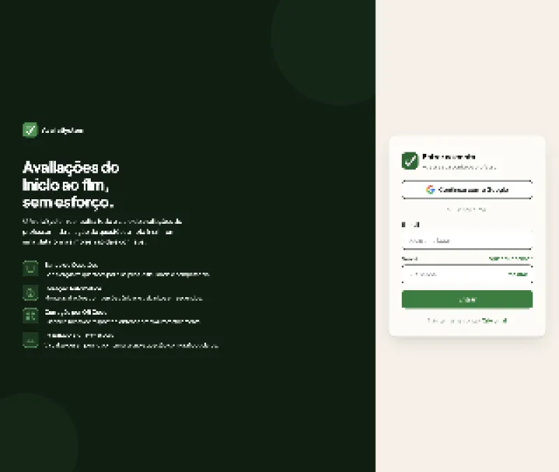
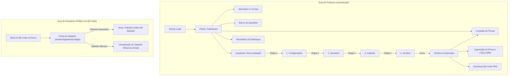

# 🎓 AvaliaSystem — Sistema de Geração e Correção Automática de Avaliações

> **Repositório Oficial** de desenvolvimento do projeto prático da disciplina de **Projeto e Arquitetura de Software**.  
> **Entrega da Fase N1 — Versão v1 Oficial** (Atendimento integral ao **Critério C3** da N1).

---

## 📑 Sumário

1. [Visão Geral do Projeto](#-visão-geral-do-projeto)
2. [Equipe e Responsabilidades Oficiais](#-equipe-e-responsabilidades-oficiais)
3. [Escopo Entregue na Fase N1](#-escopo-entregue-na-fase-n1)
4. [Requisitos do Sistema (RF e RNF da N1)](#-requisitos-do-sistema-rf-e-rnf-da-n1)
5. [Galeria de Telas e Navegação (AvaliaSystem)](#-galeria-de-telas-e-navegação-avaliasystem)
6. [Arquitetura e Tecnologias](#-arquitetura-e-tecnologias)
7. [Guia de Execução Local](#-guia-de-execução-local)
8. [Sistema Hospedado e Deploy em Nuvem](#-sistema-hospedado-e-deploy-em-nuvem)
9. [Testes e Validação de Aceitação](#-testes-e-validação-de-aceitação)
10. [Organização do Repositório e Governança](#-organização-do-repositório-e-governança)

---

## 🌟 Visão Geral do Projeto

O **AvaliaSystem** é uma plataforma acadêmica completa concebida para otimizar e automatizar todo o ciclo de vida das avaliações escolares e universitárias. Desenvolvido para simplificar o cotidiano docente, o sistema resolve desde o gerenciamento de turmas e questões até a aplicação e correção de exames com alta confiabilidade.

### Principais Benefícios:
- **Combate a fraudes e colas:** Geração de múltiplas versões da mesma avaliação (com embaralhamento controlado de questões e de alternativas), mantendo a equivalência de conteúdo.
- **Rastreabilidade e padronização:** Cada versão de prova recebe um **QR Code exclusivo** impresso no cabeçalho e na folha de respostas, identificando instantaneamente a prova e a versão.
- **Folha de respostas padronizada (A4):** Diagramação milimetricamente ajustada para impressão em qualquer impressora convencional, com marcadores fiduciais nos cantos e grade de bolhas para preenchimento.
- **Correção rápida e relatórios:** Mecanismo de leitura automatizada e simulada com geração imediata de notas, estatísticas de aproveitamento por turma e índice de discriminação por questão.
- **Transparência para o estudante:** Consulta pública restrita via QR Code para que o aluno verifique as respostas corretas de sua versão, com liberação controlada pelo professor.

---

## 👥 Equipe e Responsabilidades Oficiais

O projeto conta com papéis multidisciplinares bem definidos entre os integrantes:

| Integrante | Atribuição | Responsabilidades Oficiais |
| :--- | :--- | :--- |
| **Gabriel Koehler da Silva** | **Front-end, Mocks & Navegação** | Desenvolvimento de todas as interfaces web navegáveis no padrão *AvaliaSystem* (N1), usabilidade, responsividade, integração com a API REST Python e telas de correção/relatórios (N2), além da estruturação do repositório/Kanban (`[N1-INF-03]`) e do provedor mock state (`[N1-BE-02]`). |
| **Luan Eliseu** | **Back-end & Banco de Dados** | Desenvolvimento da API REST em Python (FastAPI), módulo de Visão Computacional / OMR via OpenCV (`cv2`) e pyzbar, integração com Supabase (`supabase-py`), regras de embaralhamento e gabaritos, CRUDs relacionais e exportação de relatórios. |
| **ALYSON DE LIMA DE OLIVEIRA** | **Documentação & Arquitetura** | Esboço inicial das classes de domínio, elaboração dos READMEs oficiais (v1 para N1 e v2 para N2), documentação formal da arquitetura em camadas e registros de decisões técnicas (ADRs). |
| **ELOISA FAZZIO DA SILVA ROCHA** | **Requisitos, Fluxos & Modelagem Conceitual** | Mapeamento completo dos fluxos de navegação e casos de uso, elaboração do roteiro de testes navegáveis de aceitação (N1), Modelagem Conceitual (MER) e Dicionário de Dados para o banco de dados (N2). |
| **DIEGO RAFAEL DA SILVA DORNELLES** | **Infraestrutura, Deploy & Modelagem Física** | Configuração de deploy contínuo em nuvem (Render/Vercel), automação do pacote de entrega C1 (.zip limpo), provisionamento do Supabase, DER Físico, scripts DDL/Seed (`schema.sql` e `seed.sql`) e Diagrama de Classes UML v2. |

---

## 🎯 Escopo Entregue na Fase N1

Na **Fase N1**, o objetivo principal consistiu na entrega do **MVP (Produto Mínimo Viável) navegável de ponta a ponta**, com layout pixel-perfect de acordo com os wireframes aprovados no Figma, fluxos integrados e ambiente de backend pronto para transição:

1. **Interfaces Visuais Completas (Padrão AvaliaSystem):**
   - Tela de Autenticação (`views/login.ejs`) com layout moderno de duas colunas, formulário de login docente, atalho com Google simulado e recuperação de senha.
   - Painel do Professor (`DashboardScreen` / `views/dashboard.ejs`) com cartões de estatísticas, gráfico semanal e ações rápidas.
   - Módulo de Semestres & Turmas com navegação mestre-detalhe, gerenciamento de status e listagem de estudantes.
   - Importador em lote de alunos via arquivo `.csv` e `.xlsx` com visualização de prévia e confirmação.
   - Banco de Questões com filtragem dinâmica por disciplina, nível de dificuldade, categoria e busca textual em tempo real.
   - Assistente de Criação de Avaliações em 4 passos sequenciais (Configuração inicial ➔ Seleção de Questões ➔ Ajuste de Gabarito ➔ Configuração de Versões).
   - Tela de Versões da Prova com download do QR Code em `.png`, visualização de gabaritos e comando para impressão.
   - Documento de Impressão A4 (`views/print.ejs`) contendo prova completa e folha de respostas pronta para uso.
   - Módulo de Correção com upload de folhas de respostas, conferência de alternativas, cálculo de nota e resumo estatístico.
   - Portal do Aluno (`views/student.ejs`) para visualização de gabarito liberado, acessível sem credenciais via QR Code.

2. **Arquitetura de Dados em Memória (Mock State Provider):**
   - Implementação do provedor de estado em memória no servidor Node.js/Express (`public/app.js`, `server.js`) para garantir navegabilidade fluida e imediata no ambiente local e hospedado.
   - Backend modular Python (FastAPI em `app/`) com contratos estruturados de endpoints, autenticação por cookie de sessão e testes unitários.

---

## 📋 Requisitos do Sistema (RF e RNF da N1)

### Requisitos Funcionais (RF)

| Código | Requisito | Módulo / Tela | Descrição |
| :---: | :--- | :--- | :--- |
| **RF01** | Autenticação do Professor | Login | Acesso seguro exclusivo do professor por e-mail/usuário e senha ou login social. |
| **RF02** | Gestão de Semestres | Semestres & Turmas | Cadastro, edição, ativação e encerramento de períodos letivos. |
| **RF03** | Gestão de Turmas | Semestres & Turmas | Criação, listagem e vinculação de turmas a um semestre ativo. |
| **RF04** | Gestão de Alunos | Semestres & Turmas | Cadastro e visualização de estudantes vinculados à turma selecionada. |
| **RF05** | Importação de Alunos | Semestres & Turmas | Importação de arquivos CSV/XLSX com validação prévia de duplicidades e confirmação. |
| **RF06** | Cadastro de Questões | Banco de Questões | Registro de enunciados com 4 ou 5 alternativas (A–D / A–E) e indicação de gabarito. |
| **RF07** | Metadados de Questões | Banco de Questões | Classificação das questões por disciplina, categoria temática e dificuldade (Fácil, Média, Difícil). |
| **RF08** | Manutenção de Questões | Banco de Questões | Edição e exclusão/arquivamento de questões, preservando histórico de provas geradas. |
| **RF09** | Filtro e Busca de Questões | Banco de Questões | Consulta em tempo real com filtros combinados de disciplina, nível e busca por texto. |
| **RF10** | Importação de Questões | Banco de Questões | Carga em lote de questões por planilha com modelo padrão disponível para download. |
| **RF11** | Validação de Importação | Banco de Questões | Relatório de consistência indicando linhas válidas e eventuais inconsistências na planilha. |
| **RF12** | Confirmação Transacional | Banco de Questões | Gravação em lote atômica após aprovação expressa do usuário na prévia. |
| **RF13** | Download de Modelos | Banco de Questões | Disponibilização de arquivos modelos `.csv` e `.xlsx` prontos para preenchimento. |
| **RF14** | Criação de Avaliação | Nova Avaliação | Assistente passo a passo para configuração de dados gerais (nome, turma, data, nota máxima). |
| **RF15** | Seleção de Questões | Nova Avaliação | Painel de escolha das questões do banco com contador dinâmico e somatório de pontos. |
| **RF16** | Ajuste de Gabarito da Prova | Nova Avaliação | Possibilidade de alterar a alternativa correta exclusivamente para a avaliação em curso. |
| **RF17** | Configuração de Versões | Nova Avaliação | Definição da quantidade de versões a serem geradas (de 1 a centenas). |
| **RF18** | Nomenclatura das Versões | Nova Avaliação | Esquemas de identificação por Letras (A, B, C), Números (1, 2, 3), Cores ou nomes customizados. |
| **RF19** | Embaralhamento de Questões | Nova Avaliação | Algoritmo que altera a ordem dos enunciados entre as versões para evitar cola. |
| **RF20** | Embaralhamento de Alternativas | Nova Avaliação | Reordenação randômica das letras de resposta mantendo o apontamento correto do gabarito. |
| **RF21** | Conjuntos de Questões | Nova Avaliação | Suporte para manter as mesmas questões reordenadas ou subconjuntos distintos por versão. |
| **RF22** | Rascunho de Avaliação | Nova Avaliação | Manutenção do estado do assistente caso o usuário queira voltar etapas antes de concluir. |
| **RF23** | Geração de Gabaritos | Versões & QR Code | Apuração automatizada e exibição clara da chave de respostas de cada versão criada. |
| **RF24** | Geração de QR Code | Versões & QR Code | Criação de imagem PNG de QR Code contendo o identificador seguro da prova e versão. |
| **RF25** | Impressão da Prova | Impressão (A4) | Diagramação otimizada para folha A4 contendo cabeçalho, instruções e questões formatadas. |
| **RF26** | Impressão de Gabarito Docente | Impressão (A4) | Folha de conferência para uso exclusivo do professor com respostas destacadas. |
| **RF27** | Folha de Respostas OMR | Impressão (A4) | Folha compacta com marcadores pretos nos cantos, QR Code e grade de bolhas para preenchimento. |
| **RF28** | Download em Lote | Versões & QR Code | Facilidade para exportação de pacotes de impressão consolidados. |
| **RF29** | Portal de Consulta do Aluno | Portal do Aluno | Página web responsiva e pública que exibe o gabarito oficial da versão escaneada via QR Code. |
| **RF30** | Controle de Liberação | Portal do Aluno | Bloqueio de visualização das respostas até que o professor faça a liberação oficial da avaliação. |

### Requisitos Não-Funcionais (RNF)

| Código | Requisito | Especificação e Critério de Aceite |
| :---: | :--- | :--- |
| **RNF01** | **Identidade Visual e UX** | Aplicação consistente do padrão *AvaliaSystem*: paleta verde escuro e cinzas neutros, tipografia limpa, hierarquia visual refinada e feedback visual claro para todas as ações. |
| **RNF02** | **Responsividade** | Interfaces totalmente adaptáveis para telas de computador (desktop) e dispositivos móveis (smartphones com viewport a partir de 375px/390px sem quebras de layout ou overflow horizontal). |
| **RNF03** | **Desempenho e Fluidez** | Tempo de resposta inferior a 200ms para trocas de tela e operações com os dados locais do MVP. |
| **RNF04** | **Compatibilidade de Impressão** | Estilos dedicados de `@media print` garantindo corte e margens perfeitos na impressão em tamanho A4 real (100%), sem barras de rolagem ou elementos de navegação indesejados. |
| **RNF05** | **Segurança de Acesso** | Proteção da área administrativa docente com cookies de sessão protegidos (`HttpOnly`, `SameSite=Lax`). |
| **RNF06** | **Privacidade do Aluno** | Acesso dos estudantes estritamente limitado à sua própria prova via link do QR Code, sem necessidade de criação de conta e sem exposição de dados de terceiros. |
| **RNF07** | **Modularidade Arquitetural** | Separação estrita em camadas (Controllers, Services, Repositories, Schemas e Views) facilitando a manutenção e a transição transparente para o banco de dados. |
| **RNF08** | **Portabilidade e Nuvem** | Arquitetura pronta para containerização via Docker e hospedagem gratuita contínua (ex.: Render e Vercel). |
| **RNF09** | **Qualidade e Testabilidade** | Cobertura abrangente de testes automatizados unitários e de integração (testes Python com `pytest` e testes Node.js). |

---

## 🖼️ Galeria de Telas e Navegação (AvaliaSystem)

O fluxo operacional do sistema foi desenvolvido com foco na usabilidade docente e agilidade na navegação diária:

### 1. Tela de Login e Boas-Vindas (`LoginScreen`)
*Apresenta o painel institucional verde à esquerda com a proposta de valor do AvaliaSystem e o formulário de login limpo à direita.*



```
+------------------------------------------+------------------------------------------+
|  [Logo AvaliaSystem]                     |  Bem-vindo de volta                      |
|                                          |  Entre com seus dados para acessar       |
|  Avaliações do início ao fim,            |                                          |
|  sem esforço.                            |  [ G Continuar com o Google ]            |
|                                          |  -- ou entre com seu e-mail --           |
|  ✓ Criação de provas com versões         |  E-mail:   [ professor@escola.edu.br ]   |
|  ✓ Folhas de resposta com QR Code        |  Senha:    [ ••••••••••• ]                |
|  ✓ Correção automatizada instantânea     |  [ Lembrar-me ]      [ Esqueci a senha ] |
|                                          |  [             Entrar             ]     |
+------------------------------------------+------------------------------------------+
```

### 2. Painel Principal do Professor (`DashboardScreen`)
*Painel de controle com visão geral do volume de avaliações, turmas cadastradas, alunos ativos e atalhos rápidos para as principais tarefas:*
- **Nova Avaliação:** Inicia o assistente de provas em 4 etapas.
- **Corrigir Prova:** Leva diretamente para o upload e leitura das folhas de resposta.
- **Ver Resultados:** Acesso aos relatórios de desempenho e notas da turma.

### 3. Gestão Acadêmica: Semestres, Turmas e Estudantes (`SemestresScreen`)
*Navegação mestre-detalhe:*
- **Coluna Lateral:** Lista de semestres letivos com badges de status (`Ativo` / `Encerrado`).
- **Área Central:** Abas dinâmicas divididas em **Turmas** (com contagem de alunos) e **Alunos** (com ferramenta de importação em lote por planilha CSV/XLSX).

### 4. Banco de Questões com Busca e Filtros (`BancoQuestoesScreen`)
*Repositório central de itens de avaliação do docente:*
- Barra de busca textual imediata.
- Filtro por disciplina e tags de categoria.
- Seletor de complexidade (Fácil, Média, Difícil).
- Modal para cadastro de novas questões com suporte a 4 ou 5 alternativas e marcação da alternativa correta.
- Ferramenta de importação em lote com modelo oficial para download.

### 5. Assistente de Criação de Avaliações em 4 Etapas (`CriarAvaliacaoScreen`)
*Guia passo a passo com barra de progresso e painel fixo de resumo lateral:*
1. **Passo 1 (Configurar):** Definição do título do exame, semestre, turma, data de aplicação e nota máxima.
2. **Passo 2 (Questões):** Seleção ágil de questões do banco, com indicação do total selecionado e pontuação por item.
3. **Passo 3 (Gabarito):** Conferência visual da resposta correta, permitindo ajustes pontuais específicos para esta prova.
4. **Passo 4 (Versões):** Escolha da quantidade de provas (ex.: Versões A, B, C), seleção de nomenclatura e ativação do embaralhamento de questões e de alternativas.

### 6. Versões, Impressão e Folha de Respostas (`VersoesScreen` / `print.ejs`)
*Geração dos artefatos físicos de aplicação da prova:*
- **Impressão da Prova (A4):** Diagramação em coluna dupla ou simples, cabeçalho institucional com espaço para identificação do aluno, instruções da prova e QR Code de identificação no topo.
- **Folha de Respostas Padronizada:** 4 marcadores quadrados nos cantos para leitura óptica, QR Code com o código da versão e grade de bolhas para preenchimento a caneta.
- **Folha de Gabarito do Docente:** Resumo impresso com as alternativas certas de cada versão para uso em sala.

### 7. Correção e Relatórios Estatísticos (`CorrecaoScreen` / `ResultadosScreen`)
*Módulo de pós-exame com simulação e correção automatizada:*
- Pré-visualização da imagem da folha escaneada.
- Leitura do QR Code e mapeamento das alternativas assinaladas.
- Apuração imediata da nota e conferência manual em caso de rasuras.
- Estatísticas automáticas: média da turma, distribuição de notas, percentual de acerto por questão e alternativas mais assinaladas.

### 8. Portal de Consulta do Aluno (`student.ejs`)
*Interface limpa e acessível via smartphone:*
- Acessada ao apontar a câmera do celular para o QR Code da prova (`/student/gabarito/{codigo}`).
- **Estado Bloqueado:** Informa que a avaliação ainda está em andamento e o gabarito não foi liberado.
- **Estado Liberado:** Exibe a tabela oficial com as alternativas corretas correspondentes à versão realizada pelo aluno.

---

### Diagrama do Fluxo de Navegação (Professor e Aluno)



---

## 🏛️ Arquitetura e Tecnologias

A solução adota uma arquitetura em camadas limpa e desacoplada, facilitando a testabilidade e evolução contínua:

```
[ Navegador Web / Dispositivos ]
             │
             ▼
[ Servidor Express / Proxy HTTP (Porta 3000) ]
  ├── Templates EJS (Views)
  ├── Estilos CSS3 (Layout Responsivo e @media print)
  └── JavaScript Modular (Client-side & Mock State)
             │
             ▼
[ API Python / FastAPI (Porta 8000) ]
  ├── Controllers / Routers (Tratamento HTTP e Validação de Esquemas Pydantic)
  ├── Services (Regras de Negócio, Embaralhamento e Geração de Gabaritos)
  ├── Repositories (Camada de Acesso a Dados e Persistência)
  └── Visão Computacional / OMR (OpenCV e Pyzbar para Decodificação QR e Bolhas)
```

### Tecnologias Utilizadas:
- **Front-end:** HTML5 semântico, CSS3 customizado (sem frameworks pesados para garantir máximo controle e renderização em impressão), JavaScript moderno modular (ES6+) e EJS (*Embedded JavaScript Templates*).
- **Back-end:** **Python 3.11** com **FastAPI** e **Uvicorn** para serviços assíncronos de alta performance, e **Node.js** com **Express** como servidor de aplicação e proxy.
- **Processamento de Imagens e QR Code:** **OpenCV (`cv2`)**, **Pyzbar** e **NumPy** para processamento digital de imagem e leitura de marcas ópticas (OMR).
- **Banco de Dados (Transição N2):** **PostgreSQL** hospedado na nuvem via **Supabase**, utilizando pools de conexão resilientes e **Supabase Storage** para armazenamento de fotos de provas.

---

## ⚙️ Guia de Execução Local

Você pode executar o projeto de forma rápida e simultânea com todos os componentes integrados:

### Pré-requisitos
- **Python 3.11** ou superior instalado e adicionado ao `PATH`.
- **Node.js 18** ou superior com `npm`.
- **Git** para clonar o repositório.

### Passo a Passo de Instalação e Execução

1. **Clonar o Repositório:**
   ```bash
   git clone https://github.com/gabriel-Koehler/projetosgp.git
   cd projetosgp
   ```

2. **Configurar o Ambiente Virtual Python:**
   ```bash
   # Criar o ambiente virtual
   python -m venv .venv

   # Ativar no Windows (PowerShell):
   .\.venv\Scripts\Activate.ps1
   # Ou Windows (Prompt de Comando):
   .\.venv\Scripts\activate.bat
   # No Linux ou macOS:
   source .venv/bin/activate

   # Instalar as dependências de desenvolvimento e da API:
   pip install -r requirements-dev.txt
   ```

3. **Instalar Dependências Node.js:**
   ```bash
   npm install
   ```

4. **Configurar Variáveis de Ambiente:**
   Copie o arquivo de exemplo para criar seu `.env`:
   ```bash
   # Windows:
   copy .env.example .env
   # Linux/macOS:
   cp .env.example .env
   ```

5. **Iniciar a Aplicação Completa:**
   Execute o script unificado que inicia o servidor web e a API:
   ```bash
   npm run dev:all
   ```

   * **Interface Web (Aplicação Completa):** [http://localhost:3000](http://localhost:3000)
   * **API FastAPI e Documentação Swagger:** [http://localhost:8000/docs](http://localhost:8000/docs)
   * **Documentação das Rotas N1:** [http://localhost:8000/n1/docs](http://localhost:8000/n1/docs)

### Credenciais Padrão de Acesso (Ambiente de Testes)
- **Usuário:** `professor`
- **Senha:** `123456`  
*(Ou utilize o botão de acesso rápido "Continuar com o Google" na tela de login).*

---

## 🌐 Sistema Hospedado e Deploy em Nuvem

O **AvaliaSystem** está preparado para publicação contínua em ambientes de computação em nuvem gratuitos (atendimento ao **Critério C2**):

* **Ambiente de Demonstração em Nuvem:** [https://projetosgp.onrender.com](https://projetosgp.onrender.com)
* **Configuração de Infraestrutura como Código:** O repositório inclui o manifesto oficial [`render.yaml`](render.yaml) configurado para build e deploy contínuo via Docker:

### Execução Local via Docker
Caso deseje rodar a aplicação em um container isolado idêntico ao ambiente de produção:

```bash
# Construir a imagem Docker
docker build -t avaliasystem-n1 .

# Executar o container na porta 3000
docker run --rm -p 3000:3000 --env-file .env avaliasystem-n1
```

O endpoint `/health` realiza a verificação de integridade (*liveness probe*) para balanceadores de carga e orquestradores em nuvem.

---

## 🧪 Testes e Validação de Aceitação

A qualidade da aplicação é assegurada por baterias de testes automatizados e roteiros de aceitação humana:

### 1. Testes Automatizados no Backend (Python)
Para rodar a suíte completa de testes unitários e de integração da API:
```bash
pytest
```
*Cobrem autenticação por cookie, criação e embaralhamento determinístico de versões, geração de QR Code, isolamento entre turmas e cálculo de gabaritos.*

### 2. Testes Automatizados do Frontend e Proxy (Node.js)
```bash
npm test
```
*Validam a conformidade das rotas, sanitização de entrada, manipulação de CSVs de questões e importação de turmas.*

### 3. Roteiro de Testes Navegáveis N1
O roteiro de testes de aceitação visual de ponta a ponta (com todos os casos de teste CT01 a CT13) está detalhado em:  
📄 [`docs/testes/roteiro-testes-n1.md`](docs/testes/roteiro-testes-n1.md)

---

## 📁 Organização do Repositório e Governança

### Estrutura de Diretórios

```
projetosgp/
├── .github/                       # Configurações do GitHub (workflows e templates)
│   └── ISSUE_TEMPLATE/
│       └── card-atividade.md      # Template oficial padronizado para issues
├── app/                           # Back-end em Python (FastAPI modular)
│   ├── controllers/               # Rotas HTTP e tratamento de requisições
│   ├── core/                      # Configurações de ambiente e segurança
│   ├── database/                  # Conexão e scripts de migração do banco
│   ├── models/                    # Entidades do domínio
│   ├── repositories/              # Camada de persistência e acesso a dados
│   ├── schemas/                   # Esquemas de validação Pydantic (JSON I/O)
│   ├── services/                  # Regras de negócio (embaralhamento, QR, OMR)
│   └── main.py                    # Ponto de entrada do FastAPI
├── docs/                          # Documentação técnica e governança
│   ├── arquitetura/               # Diagramas, classes de domínio e ADRs
│   │   ├── adr/                   # Registros formais de decisões de arquitetura
│   │   └── arquitetura-em-camadas.md
│   ├── requisitos/                # Fluxos de usuário e mapeamento de casos de uso
│   │   └── fluxos-de-usuario.md
│   ├── testes/                    # Roteiros e relatórios de aceitação
│   │   └── roteiro-testes-n1.md
│   ├── ACOMPANHAMENTO_ISSUES_GABRIEL.md # Registro oficial do ciclo de entregas
│   ├── KANBAN_BOARD.md            # Quadro Kanban com as 32 atividades
│   └── PROJECT_BACKLOG.md         # Backlog técnico com critérios de aceite
├── public/                        # Arquivos estáticos servidos no navegador
│   ├── app.js                     # Controlador principal e provedor em memória
│   ├── styles.css                 # Folha de estilos visual AvaliaSystem
│   ├── documents.css              # Regras de diagramação para impressão A4
│   ├── modelo_alunos.csv          # Planilha modelo para importação de alunos
│   └── modelo_questoes.csv        # Planilha modelo para importação de questões
├── scripts/                       # Utilitários de automação e empacotamento
│   ├── create_github_issues_kanban.py # Script de geração automática de issues
│   └── package_delivery.py        # Automação do pacote de entrega C1 (.zip)
├── src/database/                  # Scripts SQL (schema DDL e seeds)
├── tests/                         # Bateria de testes automatizados (pytest)
├── views/                         # Telas EJS renderizadas pelo servidor
│   ├── dashboard.ejs              # Painel do professor
│   ├── login.ejs                  # Tela de login e autenticação
│   ├── print.ejs                  # Layout de prova e folha de respostas A4
│   └── student.ejs                # Portal de consulta de gabarito pelo aluno
├── Dockerfile                     # Receita para containerização de produção
├── render.yaml                    # Especificação de deploy contínuo no Render
├── package.json                   # Dependências e scripts Node.js
├── requirements.txt               # Dependências Python de produção
├── requirements-dev.txt           # Dependências Python de desenvolvimento/testes
├── .env.example                   # Modelo documentado de variáveis de ambiente
└── README.md                      # Documentação técnica principal oficial (v1)
```

### Governança e Fluxo de Trabalho (Git Workflow)
O time segue rigorosamente as boas práticas de engenharia de software:
- **Quadro Kanban Oficial:** Todas as etapas são acompanhadas em [`docs/KANBAN_BOARD.md`](docs/KANBAN_BOARD.md).
- **Rastreabilidade de Issues:** Cada entrega é associada a um cartão com descrição detalhada em [`docs/PROJECT_BACKLOG.md`](docs/PROJECT_BACKLOG.md).
- **Ciclo de Branches e Commits Semânticos:** Nenhuma alteração é enviada diretamente sem validação. O ciclo obedece ao padrão:
  $$\text{Branch da Issue} \longrightarrow \text{Commits Semânticos} \longrightarrow \text{Pull Request} \longrightarrow \text{Revisão por Pares} \longrightarrow \text{Merge}$$
- **Acompanhamento Contínuo:** Todas as etapas, evidências de testes e status de PRs são mantidos atualizados em [`docs/ACOMPANHAMENTO_ISSUES_GABRIEL.md`](docs/ACOMPANHAMENTO_ISSUES_GABRIEL.md).

---

> 📌 **Nota sobre a Fase N2:** A continuidade do projeto inclui a integração com banco de dados real em nuvem (**Supabase/PostgreSQL**), persistência relacional completa, leitura óptica automática via câmera/upload com **OpenCV** e exportação de relatórios em planilhas **Excel (.xlsx)**.
