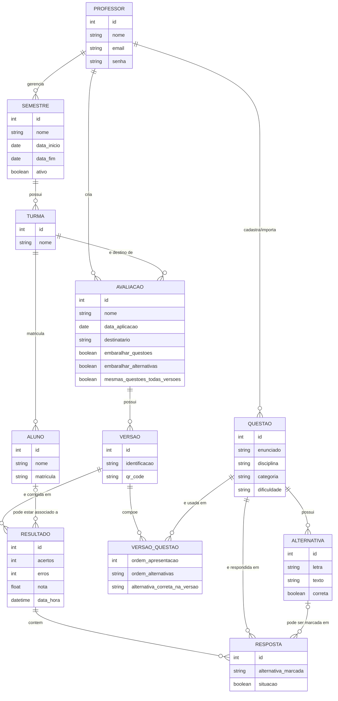

# Modelo Entidade-Relacionamento (MER) Conceitual

**Issue:** N2-MER-01 · **Etapa:** N2 – Passo 02 (Modelar Banco e ADRs)
**Critério avaliado:** C3 — Documentação (README v2): modelo de dados (MER/DER)
**Responsável:** Eloisa Fazzio da Silva Rocha
**Origem:** Documento de Requisitos e Escopo — seções 5 (Requisitos Funcionais), 7 (Modelo Conceitual Principal), 8 (Relação entre Avaliação e Versões) e RNF07 (Integridade dos dados)

> Este é o modelo **conceitual**: entidades, atributos-chave e cardinalidades, sem chaves estrangeiras nem tipos de dado — o nível lógico (DER) e o físico (MySQL) serão derivados dele em uma etapa posterior da N2.

---

## 1. Entidades e atributos

| Entidade | Atributos principais | Observação |
|---|---|---|
| **Professor** | id, nome, e-mail, senha | Único usuário autenticado (RN01) |
| **Semestre** | id, nome/período, data início, data fim, ativo | RF02 |
| **Turma** | id, nome | Vinculada a um semestre (RF03) |
| **Aluno** | id, nome, matrícula | Vinculado a uma turma (RF04); não possui conta/login (RN02) |
| **Questão** | id, enunciado, disciplina, categoria, dificuldade | Banco de questões (RF06, RF09) |
| **Alternativa** | id, letra (A–D), texto, correta (booleano) | Entidade fraca de Questão — o gabarito-base da questão vem daqui |
| **Avaliação** | id, nome, data de aplicação, destinatário, embaralhar questões (S/N), embaralhar alternativas (S/N), mesmas questões em todas as versões (S/N) | RF14; agrupa as versões (seção 8) |
| **Versão** | id, identificação (A/B/C, 1/2/3, cor ou personalizada), QR Code | RF17, RF18, RF28 |
| **Versão_Questão** (associativa) | ordem de apresentação da questão, ordem de apresentação das alternativas, alternativa correta *nesta versão* | Resolve o N:N entre Versão e Questão; guarda o **gabarito próprio de cada versão** (RN06) preservando a resposta correta após embaralhar (RN07/RF25) |
| **Resultado** | id, acertos, erros, nota, data/hora da correção | Gerado pela correção automática (RF39) |
| **Resposta** | id, alternativa marcada (pode ser nula/ilegível), situação (certa/errada) | Detalhe de cada questão dentro de um Resultado (RF42) |

---

## 2. Relacionamentos e cardinalidades

| Entidade A | Cardinalidade | Entidade B | Relacionamento | Requisito |
|---|---|---|---|---|
| Professor | 1 : N | Semestre | gerencia | RF02 |
| Semestre | 1 : N | Turma | possui | RF03 |
| Turma | 1 : N | Aluno | matricula | RF04 |
| Professor | 1 : N | Questão | cadastra/importa | RF06, RF10 |
| Questão | 1 : N | Alternativa | possui (tipicamente 4) | RF06 |
| Professor | 1 : N | Avaliação | cria | RF14 |
| Turma | 1 : N | Avaliação | é destino de | RF14 |
| Avaliação | 1 : N | Versão | possui (uma avaliação, várias versões — seção 8) | RF17 |
| Versão | 1 : N | Versão_Questão | compõe | RF19, RF20 |
| Questão | 1 : N | Versão_Questão | é usada em | RF19, RF20 |
| Versão | 1 : N | Resultado | é corrigida em (uma versão pode ser aplicada e corrigida várias vezes) | RF37 |
| Aluno | 0/1 : N | Resultado | pode estar associado a | RF39 ("aluno quando associado") |
| Resultado | 1 : N | Resposta | contém | RF39 |
| Questão | 1 : N | Resposta | é respondida em | RF35 |
| Alternativa | 0/1 : N | Resposta | pode ser marcada em (marcação pode estar ausente/ilegível) | RF36 |

> **Nota de normalização:** a Avaliação não se relaciona diretamente com Semestre — essa informação é obtida via Turma → Semestre, evitando redundância. RF14 pede que o formulário de criação "informe" o semestre, mas isso pode ser um campo derivado da turma selecionada na interface, não uma relação própria no banco.

---

## 3. Diagrama (Mermaid ER)



---

## 4. Rastreabilidade — cadeia de integridade (RNF07)

RNF07 exige manter a relação **Avaliação → Versão → Questões → Alternativas → Gabarito → Respostas → Resultado**. No modelo acima essa cadeia corresponde a:

```
AVALIAÇÃO → VERSÃO → VERSÃO_QUESTÃO (gabarito da versão) → QUESTÃO → ALTERNATIVA
                                                                 ↓
                                                        RESPOSTA ← RESULTADO
```

- **Gabarito por versão** (RN06) é armazenado em `Versão_Questão.alternativa_correta_na_versao`, não na Questão — assim, embaralhar as alternativas em uma versão não afeta as outras.
- **Preservação da resposta correta ao embaralhar** (RN07/RF25) é garantida porque `Alternativa.correta` nunca muda; só a ordem de exibição (`Versão_Questão.ordem_alternativas`) é reorganizada por versão.
- **Aluno associado é opcional** em `Resultado`, refletindo RF39 ("aluno quando associado") — nem toda correção precisa estar vinculada a um aluno cadastrado.

---

## 5. Próximos passos (fora do escopo desta issue)

- Derivar o modelo lógico/DER com chaves primárias e estrangeiras explícitas.
- Definir tipos de dado e constraints para o MySQL (RNF08).
- Registrar decisões de arquitetura relacionadas (ADRs) separadamente.
