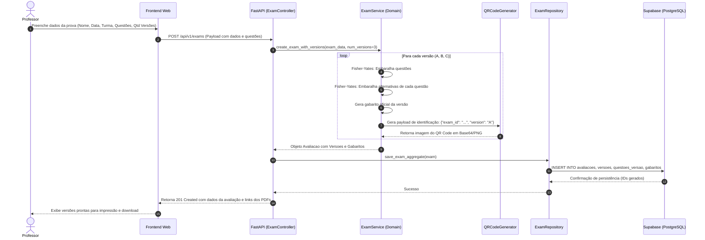
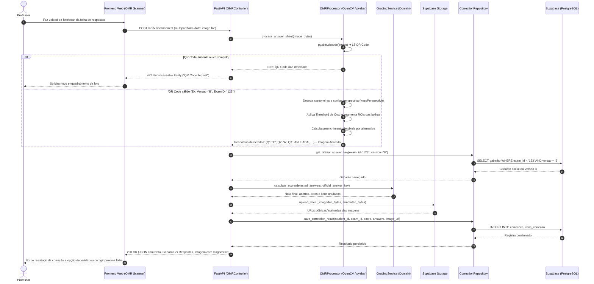
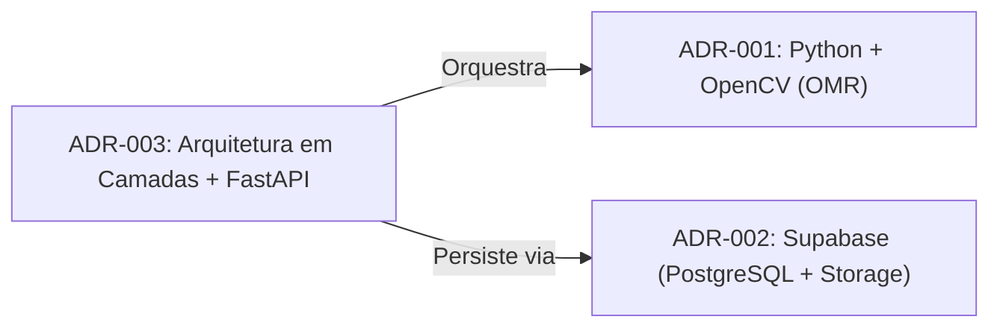

# Documentação da Arquitetura em Camadas e Decisões Técnicas (ADRs)

> **Documento Oficial de Arquitetura de Software — Fase N2**  
> **Identificação do Card:** `[N2-DOC-01]` | **Prioridade:** `P1 (Alta)` | **Etapa:** Passo 02 (Modelar Banco e ADRs)  
> **Responsável:** ALYSON DE LIMA DE OLIVEIRA  
> **Revisor:** Luan Eliseu / Gabriel Koehler da Silva  
> **Critério Atendido:** Critério C3 (20% da avaliação da Fase N2)  

---

## 1. Introdução e Contexto do Sistema

O **Sistema de Geração e Correção Automática de Avaliações (SGP)** é uma solução desenvolvida no âmbito da disciplina de **Projeto e Arquitetura de Software** com o objetivo de automatizar o ciclo completo de vida de avaliações acadêmicas presenciais.

O fluxo de valor do sistema compreende:
1. **Gestão Curricular:** Cadastro e organização de semestres, disciplinas, turmas e alunos.
2. **Banco de Questões:** Manutenção de itens avaliativos com classificação por disciplina, dificuldade e tópicos.
3. **Elaboração e Embaralhamento de Avaliações:** Criação de provas com geração determinística de múltiplas versões (ex: Versões A, B e C), embaralhando tanto a ordem das questões quanto a ordem das alternativas.
4. **Instrumentos de Avaliação Impressos:** Emissão de cadernos de prova, folhas de resposta padronizadas contendo marcadores de ancoragem e QR Codes de identificação da versão, além de gabaritos oficiais para conferência.
5. **Correção Automática via OMR (Optical Mark Recognition):** Reconhecimento óptico de marcas a partir de fotos ou digitalizações das folhas de resposta, identificando automaticamente a versão da prova via QR Code, alinhando a perspectiva da imagem, segmentando e inferindo as alternativas assinaladas.
6. **Persistência e Consolidação de Resultados:** Armazenamento seguro de notas, respostas assinaladas, imagens auditáveis da folha de respostas e geração de relatórios estatísticos de rendimento.

Para atender a esses requisitos com robustez, manutenibilidade, separação de responsabilidades (*Separation of Concerns - SoC*) e alta coesão, adotou-se o **Padrão Arquitetural em Camadas (Layered Architecture)**, complementado por microsserviços/módulos especializados de visão computacional.

---

## 2. Visão Geral da Arquitetura em Camadas

A arquitetura do sistema foi desenhada seguindo o princípio da dependência unidirecional (*Top-Down*), onde cada camada só conhece a camada imediatamente inferior (ou abstrações fornecidas por ela), evitando acoplamento cíclico e facilitando testes unitários e de integração.

```mermaid
flowchart TD
    subgraph UI ["Camada de Apresentação (Presentation Layer)"]
        UI1["Web Frontend (HTML5 / CSS3 / JS Modular / EJS)"]
        UI2["Interface do Professor (Dashboard, Banco, Provas, OMR)"]
        UI3["Interface Pública do Aluno (Visualização de Gabarito)"]
        UI4["Folhas de Resposta & Cadernos (@media print)"]
    end

    subgraph API ["Camada de Aplicação e API (Application & API Layer)"]
        API1["FastAPI Application (Python 3.11)"]
        API2["Controladores RESTful (Auth, Turmas, Questões, Provas, OMR)"]
        API3["DTOs e Validação de Entrada (Pydantic Schemas)"]
        API4["Middlewares (CORS, Sessão, Tratamento de Exceções)"]
    end

    subgraph DOMAIN ["Camada de Domínio e Regras de Negócio (Domain Layer)"]
        DOM1["Entidades de Domínio (Professor, Questao, Avaliacao, Versao, FolhaResposta)"]
        DOM2["Serviço de Embaralhamento (Fisher-Yates Determinístico)"]
        DOM3["Serviço de Correção e Cálculo de Notas (GradingService)"]
        DOM4["Regras de Negócio e Validações de Integridade"]
    end

    subgraph VISION ["Camada de Visão Computacional / OMR (Vision & OMR Service)"]
        VIS1["Módulo OMR (OpenCV / cv2)"]
        VIS2["Decodificador de QR Code (pyzbar)"]
        VIS3["Correção de Perspectiva e Alinhamento de Âncora"]
        VIS4["Thresholding Adaptativo e Segmentação de Bolhas (NumPy)"]
    end

    subgraph REPO ["Camada de Acesso a Dados / Repositórios (Data Access Layer)"]
        REP1["Padrão Repository (Ex: QuestionRepository, ExamRepository)"]
        REP2["Cliente Supabase SDK (supabase-py)"]
        REP3["Mapeadores de Dados (ORM / Data Mappers)"]
    end

    subgraph INFRA ["Camada de Infraestrutura e Persistência (Infrastructure Layer)"]
        INF1["Supabase PostgreSQL (Tabelas, Relacionamentos, Constraints, RLS)"]
        INF2["Supabase Storage (Bucket de Imagens de Folhas e Scans)"]
        INF3["Supavisor (Connection Pooling PostgreSQL)"]
    end

    UI -->|Requisições HTTP / JSON / Multipart| API
    API -->|Coordena Casos de Uso| DOMAIN
    API -->|Processamento de Imagem| VISION
    DOMAIN -->|Solicita Dados| REPO
    VISION -->|Retorna Bolhas Marcadas| DOMAIN
    REPO -->|Executa Consultas e Mutations| INFRA
```



---

## 3. Detalhamento das Camadas do Sistema

### 3.1. Camada de Apresentação (Presentation / UI Layer)

* **Tecnologias:** HTML5 semântico, CSS3 moderno com variáveis customizadas, JavaScript modular e templates EJS (na fase inicial) integrados à API.
* **Responsabilidades:**
  * Renderizar as telas administrativas para o Professor (único perfil autenticado, conforme RN01 e RN02).
  * Renderizar a interface minimalista e somente leitura para o Aluno (acesso ao gabarito estático da sua versão após leitura do QR Code, sem acesso a notas ou banco de questões).
  * Implementar estilos dedicados de impressão via `@media print`, garantindo que cadernos de prova e folhas de respostas sejam impressos com dimensões milimétricas precisas (formato A4) e marcadores de calibração alinhados nos quatro cantos.
  * Capturar fotos ou receber uploads de digitalizações das folhas de resposta preenchidas pelos alunos.
* **Componentes Principais:**
  * `DashboardView`: Indicadores de desempenho, estatísticas da semana e atalhos rápidos.
  * `EvaluationWizardView`: Assistente em 4 passos (Configurar → Selecionar Questões → Definir Gabarito → Configurar Versões).
  * `OMRScannerView`: Interface de envio e pré-visualização da folha de respostas com feedback em tempo real.
  * `StudentFeedbackView`: Consulta pública de gabarito por versão.

### 3.2. Camada de Aplicação e API (Application & API Layer)

* **Tecnologias:** Python 3.11, **FastAPI**, **Pydantic v2**, Uvicorn (ASGI Server).
* **Responsabilidades:**
  * Expor endpoints HTTP RESTful padronizados para consumo pela camada de apresentação.
  * Validar rigorosamente os formatos de entrada e saída por meio de DTOs (*Data Transfer Objects*) usando Pydantic.
  * Controlar ciclo de vida de requisições assíncronas (`async/await`) para operações de I/O em banco de dados e upload para o storage.
  * Tratar exceções de negócio e traduzi-las em respostas HTTP com códigos de status semânticos (200, 201, 400, 404, 422, 500).
* **Endpoints Principais:**
  * `POST /api/v1/auth/login`: Autenticação do professor.
  * `GET/POST /api/v1/questions`: Listagem e cadastro de itens no banco de questões.
  * `POST /api/v1/exams`: Criação da avaliação e orquestração do embaralhamento de versões.
  * `GET /api/v1/exams/{id}/versions/{version_letter}/sheet`: Emissão da folha de resposta em PDF/imagem com QR Code.
  * `POST /api/v1/omr/correct`: Recebimento da imagem da folha, acionamento do pipeline de OMR, comparação com o gabarito oficial e persistência da nota.
  * `GET /api/v1/exams/{id}/results`: Consolidação estatística e exportação de relatórios.

### 3.3. Camada de Domínio e Lógica de Negócio (Domain Layer)

* **Tecnologias:** Classes puras em Python (*Plain Old Python Objects*), bibliotecas padrão (`random`, `dataclasses`, `uuid`).
* **Responsabilidades:**
  * Isolar as regras de negócio de qualquer framework web ou banco de dados.
  * **Algoritmo de Embaralhamento (Shuffling Engine):** Implementação determinística baseada no algoritmo de Fisher-Yates. Para cada versão solicitada (ex: A, B, C):
    1. Gera uma semente determinística atrelada ao identificador da avaliação e à letra da versão.
    2. Embaralha a ordem das questões.
    3. Para cada questão, embaralha a ordem das alternativas, mantendo o mapeamento reverso da alternativa original correta.
    4. Gera o gabarito consolidado da respectiva versão.
  * **Mecanismo de Correção e Pontuação (Grading Engine):**
    1. Confronta as alternativas detectadas pelo OMR com o gabarito oficial daquela versão.
    2. Atribui pontuação ponderada por questão.
    3. Identifica anulações (múltiplas marcações na mesma questão) ou questões em branco.
    4. Calcula a nota final do aluno e o percentual de aproveitamento.

### 3.4. Camada de Visão Computacional e OMR (Optical Mark Recognition Layer)

* **Tecnologias:** **OpenCV (`cv2`)**, **pyzbar**, **NumPy**.
* **Responsabilidades:**
  * Realizar o processamento digital de imagem sem depender de serviços externos pagos ou conexões de rede de terceiros.
  * **Pipeline de Execução:**
    ```
    Imagem Original (Scan/Foto)
       ⬇
    1. Detecção e Leitura do QR Code (pyzbar) ➔ Identifica versão da prova e ID
       ⬇
    2. Pré-processamento (Conversão Grayscale + Blur Gaussiano + Binarização de Otsu)
       ⬇
    3. Detecção de Marcadores de Canto (Cantoneiras de Calibração)
       ⬇
    4. Transformação Geométrica de Perspectiva (Four-Point Perspective Warp)
       ⬇
    5. Segmentação das Coordenadas da Grade de Respostas (ROIs de Bolhas)
       ⬇
    6. Contagem de Densidade de Pixels Preenchidos por Alternativa (NumPy)
       ⬇
    7. Classificação das Marcações (A, B, C, D, E, Em Branco, Dupla Marcação)
    ```
* **Mecanismos de Resiliência:**
  * Tolerância a rotações leves e inclinação através da normalização de perspectiva pelas cantoneiras.
  * Tratamento de rasuras por threshold diferencial entre a bolha mais preenchida e a segunda mais preenchida.

### 3.5. Camada de Acesso a Dados / Repositórios (Data Access Layer)

* **Tecnologias:** Cliente oficial `supabase-py`, PostgREST.
* **Responsabilidades:**
  * Encapsular as consultas SQL, inserções e atualizações através do padrão Repository.
  * Isolar a camada de domínio das particularidades de conexão com o banco de dados.
  * Mapear estruturas de tabelas relacionais para objetos de domínio e DTOs.
  * Implementar transações lógicas e tratamento de erros de violação de integridade referencial.

### 3.6. Camada de Infraestrutura e Persistência (Infrastructure Layer)

* **Tecnologias:** **Supabase Cloud (PostgreSQL 15+)**, **Supabase Storage**.
* **Responsabilidades:**
  * Armazenamento relacional consistente (conformidade ACID) com integridade referencial estrita (chaves primárias, chaves estrangeiras, `ON DELETE CASCADE/RESTRICT`, checks).
  * Gerenciamento de arquivos e blobs: Supabase Storage Bucket (`answer-sheets`) para armazenar os arquivos originais escaneados e as imagens processadas com as marcações desenhadas pelo OpenCV (para auditoria do professor).
  * Gerenciamento de conexões via *Supavisor* (Connection Pooler em modo transaction) para assegurar estabilidade sob concorrência.

---

## 4. Diagramas de Sequência e Casos de Uso Críticos

### 4.1. Fluxo de Geração de Avaliação com Múltiplas Versões



### 4.2. Fluxo de Correção Automática de Folha de Respostas (OMR)



---

## 5. Registros de Decisões Arquiteturais (ADRs)

A seguir, registram-se formalmente as decisões técnicas que orientam o desenvolvimento e a infraestrutura do projeto, no formato consagrado de **Architectural Decision Records (ADRs)**.



---

### 📑 ADR-001: Adoção do Python e OpenCV para Visão Computacional e Leitura Óptica de Marcas (OMR)

* **Status:** Aprovado  
* **Data da Decisão:** Outubro de 2024 / Fase N2  
* **Contexto Técnico:**  
  O sistema exige uma funcionalidade crítica de correção automática de avaliações a partir de fotografias capturadas por smartphones ou digitalizações em scanner de mesa. Isso impõe desafios significativos: variações de iluminação, pequenas inclinações angulares na captura, sombras, dobras no papel e qualidade de preenchimento das bolhas pelos estudantes (lápis grafite ou caneta esferográfica). Precisávamos de um ecossistema maduro para manipulação de matrizes de pixels, detecção de padrões geométricos e leitura de códigos bidimensionais (QR Code).

* **Decisão Arquitetural:**  
  Adotar **Python 3.11** como linguagem de processamento central, combinada com as bibliotecas:
  * **OpenCV (`opencv-python-headless`):** Para pré-processamento de imagens (conversão de espaço de cores, binarização adaptativa, filtros gaussianos, detecção de contornos e transformações afins/perspectiva).
  * **pyzbar:** Para localização e decodificação ultrarrápida do QR Code de identificação da folha de respostas.
  * **NumPy:** Para operações vetoriais de contagem de densidade de pixels nas regiões de interesse (ROIs) das bolhas.

* **Alternativas Consideradas:**
  1. *Bibliotecas OMR / OCR em JavaScript/Node.js (ex: Tesseract.js, Jimp, OpenCV.js):*
     * *Motivo da rejeição:* Desempenho computacional inferior para transformações de matrizes contínuas, suporte limitado e complexidade para detecção confiável de cantoneiras geométricas e transformações de perspectiva sem wrappers instáveis em C++.
  2. *Serviços de OCR em Nuvem (Google Cloud Vision API, AWS Textract):*
     * *Motivo da rejeição:* Custo financeiro por requisição inviável para ambiente acadêmico, latência de rede adicional e falta de flexibilidade para regras de OMR específicas (como detectar intensidade de preenchimento relativo de círculos contíguos).

* **Consequências Positivas:**
  * **Estado da Arte em Visão Computacional:** OpenCV é o padrão industrial absoluto, oferecendo precisão matemática incomparável para transformação de perspectiva (`warpPerspective`) e binarização de Otsu.
  * **Execução 100% Local e Gratuita:** Sem custos com APIs externas de terceiros; processamento executado no próprio servidor da aplicação.
  * **Confiabilidade:** O uso de marcadores de canto combinado com a leitura de QR Code via `pyzbar` elimina falhas de identificação de versões de avaliação.
  * **Auditoria Visual:** O OpenCV permite desenhar círculos verdes (acertos) e vermelhos (erros) diretamente na imagem processada, gerando um comprovante visual para o professor e o aluno.

* **Consequências Negativas / Mitigações:**
  * *Consumo de Memória e CPU:* Operações de visão computacional demandam processamento. *Mitigação:* As imagens recebidas são redimensionadas para uma resolução padrão (ex: largura máxima de 1600px) antes da análise, mantendo a fidelidade das bolhas com processamento médio inferior a 800ms por folha.
  * *Dependências de Sistema Operacional (libzbar):* Requer a instalação de bibliotecas nativas de decodificação. *Mitigação:* Inclusão documentada no `Dockerfile` e no script de configuração de ambiente.

---

### 📑 ADR-002: Adoção do Supabase (PostgreSQL Cloud + Supabase Storage) para Banco de Dados e Armazenamento de Arquivos

* **Status:** Aprovado  
* **Data da Decisão:** Outubro de 2024 / Fase N2  
* **Contexto Técnico:**  
  O sistema necessita de persistência relacional com forte integridade para modelar a hierarquia acadêmica: Semestres → Turmas → Alunos → Avaliações → Questões → Alternativas → Versões → Gabaritos → Correções → Respostas dos Itens. Além disso, o sistema precisa armazenar arquivos binários pesados (fotos e scans originais das folhas de resposta, além das imagens processadas com anotações de correção) sem sobrecarregar o banco relacional nem o servidor de aplicação.

* **Decisão Arquitetural:**  
  Adotar a plataforma **Supabase** como infraestrutura unificada de dados, utilizando:
  * **Supabase PostgreSQL:** Instância gerenciada de banco relacional PostgreSQL com suporte a schemas relacionais, chaves estrangeiras com integridade referencial, índices B-Tree e tipos nativos (como JSONB para metadados flexíveis).
  * **Supabase Storage:** Buckets de objetos (compatíveis com S3) para armazenamento seguro das imagens das folhas de respostas escaneadas.
  * **supabase-py:** SDK oficial em Python para integração rápida e transacional com a API e os repositórios.

* **Alternativas Consideradas:**
  1. *SQLite Local:*
     * *Motivo da rejeição:* Não permite concorrência adequada em ambiente de produção em nuvem (Render/Vercel) devido a locks de escrita e falta de persistência de disco em contêineres efêmeros (*ephemeral filesystems*).
  2. *Banco NoSQL / Documental (ex: MongoDB, Firebase Firestore):*
     * *Motivo da rejeição:* Inadequado para o domínio do projeto, que é estritamente relacional. A perda de integridade referencial por chaves estrangeiras provocaria inconsistências graves entre avaliações, turmas e itens de gabarito.
  3. *PostgreSQL Auto-Hospedado em Máquina Virtual (VPS / EC2):*
     * *Motivo da rejeição:* Overhead de manutenção de infraestrutura, rotinas manuais de backup, configuração de SSL e gerenciamento de firewall desnecessários para a escala do projeto.

* **Consequências Positivas:**
  * **Integridade Referencial Absoluta:** O PostgreSQL garante a conformidade ACID e impossibilita estados inválidos (ex: uma correção existir sem uma versão de avaliação correspondente).
  * **Solução Completa em Nuvem:** Elimina a necessidade de configurar servidores de banco de dados dedicados ou serviços adicionais de storage (como AWS S3 separado).
  * **Auditoria e Armazenamento Centralizado:** As imagens das folhas ficam salvas no bucket `answer-sheets`, associadas por URL ao registro da correção no banco de dados.
  * **Pronto para Escala:** Disponibilidade de pooling de conexões (*Supavisor*) e recursos futuros como autenticação nativa e Row-Level Security (RLS).

* **Consequências Negativas / Mitigações:**
  * *Dependência de Conexão com a Internet:* O ambiente local de desenvolvimento requer acesso ao projeto Supabase ou execução do Supabase CLI local com Docker. *Mitigação:* Disponibilização de scripts DDL padronizados (`src/database/schema.sql` e `seed.sql`) que podem ser executados tanto no Supabase em nuvem quanto em qualquer PostgreSQL local.

---

### 📑 ADR-003: Adoção do FastAPI e Separação em Camadas para o Backend

* **Status:** Aprovado  
* **Data da Decisão:** Outubro de 2024 / Fase N2  
* **Contexto Técnico:**  
  Na fase N1, o protótipo inicial navegável utilizou Node.js/Express para validação de fluxos e telas. Contudo, para a fase N2, a inclusão do módulo central de Visão Computacional (OpenCV em Python) exigiu uma reavaliação da arquitetura de backend. Era necessário decidir entre: (a) manter o backend em Node.js e criar um microsserviço Python apenas para OpenCV via chamadas de subprocesso/HTTP, ou (b) unificar o backend de regras de negócio, OMR e persistência em Python com um framework moderno de alta performance.

* **Decisão Arquitetural:**  
  Adotar **FastAPI (Python 3.11)** como o framework oficial de backend da aplicação, estruturado estritamente segundo o padrão de **Arquitetura em Camadas** (Controladores → Serviços de Domínio → Processador OMR → Repositórios → Supabase). O frontend web consome essa API de forma desacoplada via requisições REST/JSON e Multipart.

* **Alternativas Consideradas:**
  1. *Backend Híbrido com Node.js chamando scripts Python via `child_process`:*
     * *Motivo da rejeição:* Elevado custo de serialização/desserialização de dados, inicialização repetitiva do interpretador Python a cada folha corrigida (gerando latência inaceitável de mais de 3 segundos por prova), e dificuldade de depuração de erros.
  2. *Framework Python Django:*
     * *Motivo da rejeição:* Framework monolítico muito pesado, com ORM próprio complexo que entra em atrito com o modelo de integração simplificado do Supabase, além de menor performance assíncrona se comparado ao FastAPI.
  3. *Framework Flask:*
     * *Motivo da rejeição:* Não possui suporte nativo a validação por tipos de dados (Pydantic), documentação OpenAPI/Swagger automática nem modelo assíncrono nativo de alta performance sem bibliotecas adicionais.

* **Consequências Positivas:**
  * **Desempenho Nativo:** FastAPI opera sobre ASGI (Starlette e Uvicorn), situando-se entre os frameworks web mais rápidos do mercado.
  * **Interoperabilidade Total com OpenCV e NumPy:** Como a API e o OMR rodam no mesmo ambiente Python, a imagem recebida via upload é manipulada diretamente na memória RAM como um `numpy.ndarray`, sem necessidade de I/O em disco temporário.
  * **Documentação Automática:** Geração instantânea de documentação interativa nos padrões OpenAPI e Swagger UI (`/docs`), acelerando o trabalho da equipe de frontend.
  * **Tipagem Estrita com Pydantic:** Detecção em tempo de desenvolvimento de inconsistências em dados de entrada e saída.

* **Consequências Negativas / Mitigações:**
  * *Curva de Aprendizado para Programação Assíncrona em Python:* O uso incorreto de chamadas síncronas bloqueantes dentro de rotas `async` pode degradar o event loop. *Mitigação:* As rotas de OMR utilizam *threadpools* dedicados do FastAPI (`def` síncrono padrão ou `run_in_threadpool`), garantindo que o processamento do OpenCV não bloqueie as demais requisições HTTP da API.

---

## 6. Mapeamento dos Requisitos Não-Funcionais (RNFs)

A arquitetura em camadas foi projetada para garantir a conformidade com todos os requisitos não-funcionais estabelecidos no projeto da disciplina:

| Requisito Não-Funcional (RNF) | Estratégia Arquitetural Adotada | Camada Responsável |
| :--- | :--- | :--- |
| **RNF01: Desempenho no OMR** | Processamento em memória (`numpy.ndarray`), redimensionamento controlado de imagem e decodificação via `pyzbar` em C compilado. Tempo médio de resposta < 1.5s por folha. | Camada de Visão Computacional / OMR |
| **RNF02: Integridade de Dados** | Modelagem relacional estrita no PostgreSQL com constraints (`NOT NULL`, `UNIQUE`, `FOREIGN KEY` com `ON DELETE CASCADE/RESTRICT`). | Camada de Infraestrutura (Supabase) |
| **RNF03: Segurança e Isolamento** | Separação rígida de papéis: o aluno só acessa gabarito público da sua versão via endpoint aberto sanitizado; todas as rotas administrativas exigem credenciais válidas do professor (RN01, RN02). | Camada de Aplicação / API |
| **RNF04: Manutenibilidade e Baixo Acoplamento** | Padrão Repository desacopla a regra de negócio do provedor de dados; serviços de domínio puros sem dependências de frameworks externos. | Camada de Domínio e Repositórios |
| **RNF05: Auditabilidade de Correções** | As imagens originais e as imagens anotadas com caixas delimitadoras e diagnósticos das bolhas são salvas no Supabase Storage e vinculadas às correções. | Camada de Infraestrutura / Storage |
| **RNF06: Portabilidade e Impressão** | Folhas de resposta com folhas de estilo CSS `@media print` fixadas no padrão internacional A4 com cantoneiras de alinhamento em pontos fixos. | Camada de Apresentação |

---

## 7. Conclusão e Próximos Passos da Fase N2

A documentação da **Arquitetura em Camadas** e os registros das decisões técnicas (**ADRs**) consolidam as diretrizes de engenharia que sustentam o projeto SGP na Fase N2. 

A estrutura garante:
1. **Transparência Técnica:** Cada escolha tecnológica está fundamentada por critérios objetivos de viabilidade, custo, desempenho e aderência aos requisitos.
2. **Harmonia na Equipe:** As responsabilidades de cada integrante (Frontend, Backend, Visão Computacional, Infraestrutura e Requisitos) se encaixam de forma modular sobre os contratos definidos pelas camadas.
3. **Atendimento aos Critérios Oficiais:** Plena conformidade com o **Passo 02 do Escopo** e com o **Critério C3 (20% da avaliação da Fase N2)**.

Os próximos passos dependentes desta arquitetura compreendem:
* `[N2-MER-01]` e `[N2-MER-02]`: Modelagem conceitual do MER e dicionário de dados detalhado.
* `[N2-INF-01]`: Provisionamento efetivo do Supabase com os scripts `schema.sql` e `seed.sql`.
* `[N2-INF-02]`: Diagrama de Classes UML v2 refletindo com exatidão as entidades e serviços especificados neste documento.
