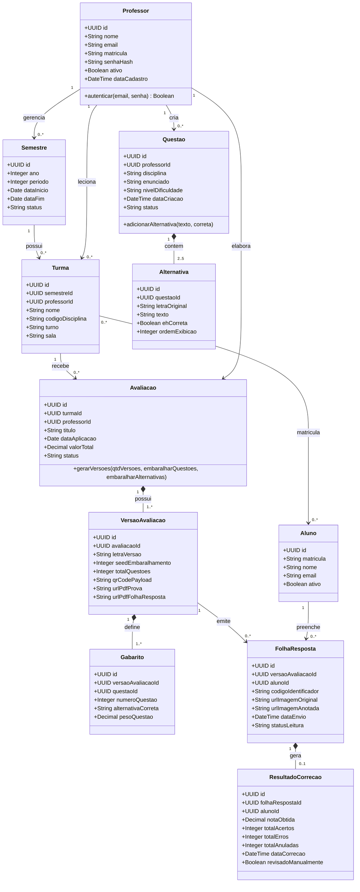

# Esboço Inicial das Classes de Domínio do Sistema — Fase N1

> **Documento Oficial de Engenharia de Software — Fase N1**  
> **Identificação do Card:** `[N1-DOC-01]` | **Prioridade:** `P0 (Crítica)` | **Etapa:** Passo 02 (Briefing e Classes de Domínio da N1)  
> **Responsável:** ALYSON DE LIMA DE OLIVEIRA  
> **Revisora Designada:** ELOISA FAZZIO DA SILVA ROCHA  
> **Requisito Atendido:** Passo 02 do documento oficial "Escopo do Projeto e Critérios de Avaliação"  

---

## 1. Introdução e Propósito

Este documento apresenta a modelagem conceitual inicial das **classes de domínio** do **Sistema de Geração e Correção Automática de Avaliações (SGP)**. 

O modelo foi construído a partir do relato do cliente, das regras de negócio estabelecidas na disciplina e dos fluxos documentados em [`docs/requisitos/fluxos-de-usuario.md`](../requisitos/fluxos-de-usuario.md), cobrindo:
1. A gestão de semestres letivos, turmas e enturmação de discentes.
2. A estruturação do banco de questões e suas alternativas.
3. O mecanismo de composição de avaliações e derivação determinística de múltiplas versões (ex: Versões A, B e C).
4. O ciclo de impressão de folhas de respostas com identificação por QR Code e seu posterior processamento via Leitura Óptica de Marcas (OMR).
5. A consolidação dos gabaritos e notas de correção.

Este esboço atua como **contrato conceitual primário**, servindo como especificação orientadora para o desenvolvimento dos provedores de estado (mock state) da Fase N1 e como base direta para a futura Modelagem Conceitual de Dados (MER) e Diagrama de Classes UML v2 da Fase N2.

---

## 2. Diagrama de Classes Conceitual do Domínio

O diagrama abaixo, modelado em padrão UML via Mermaid, ilustra as **11 entidades fundamentais**, seus principais atributos e os relacionamentos de cardinalidade que regem o sistema:

---

## 3. Especificação Detalhada das 11 Classes de Domínio

### 3.1. `Professor`
Representa o docente responsável por ministrar aulas, gerenciar turmas, cadastrar questões, formular provas e supervisionar o processo de correção.
* **Papel no Sistema:** É o único usuário com credenciais de login e privilégios administrativos (conforme RN01).
* **Atributos:**
  * `id` (`UUID`): Identificador único universal.
  * `nome` (`String`): Nome completo do professor.
  * `email` (`String`): Endereço de e-mail institucional e login de acesso.
  * `matricula` (`String`): Código funcional do docente.
  * `senhaHash` (`String`): Hash criptográfico da senha de acesso.
  * `ativo` (`Boolean`): Indicador de atividade cadastral.
  * `dataCadastro` (`DateTime`): Registro cronológico de criação.
* **Relacionamentos:**
  * Leciona em `0..*` instâncias de `Turma`.
  * É autor de `0..*` instâncias de `Questao`.
  * Cria e gerencia `0..*` instâncias de `Avaliacao`.

---

### 3.2. `Semestre`
Delimita temporalmente o período acadêmico vigente ou histórico (ex: 2024/1, 2024/2).
* **Papel no Sistema:** Unidade de agrupamento temporal que organiza as turmas ativas e os registros históricos.
* **Atributos:**
  * `id` (`UUID`): Identificador único.
  * `ano` (`Integer`): Ano civil de referência (ex: 2024).
  * `periodo` (`Integer`): Período letivo semestral (1 ou 2).
  * `dataInicio` (`Date`): Início do semestre letivo.
  * `dataFim` (`Date`): Término previsto do semestre letivo.
  * `status` (`String`): Situação cadastral (`PLANEJADO`, `ATIVO`, `ENCERRADO`).
* **Relacionamentos:**
  * Contém `0..*` instâncias de `Turma`.

---

### 3.3. `Turma`
Representa uma oferta disciplinar específica vinculada a um semestre letivo e sob responsabilidade de um professor.
* **Papel no Sistema:** Entidade central de agregação de alunos que realizarão as avaliações.
* **Atributos:**
  * `id` (`UUID`): Identificador único.
  * `semestreId` (`UUID`): Referência obrigatória ao semestre de vinculação.
  * `professorId` (`UUID`): Referência obrigatória ao professor titular.
  * `nome` (`String`): Denominação da turma (ex: "Engenharia de Software - Turma A").
  * `codigoDisciplina` (`String`): Código identificador da disciplina (ex: "ESW004").
  * `turno` (`String`): Turno de realização (`MATUTINO`, `VESPERTINO`, `NOTURNO`).
  * `sala` (`String`): Local físico padrão das aulas.
* **Relacionamentos:**
  * Pertence a `1` `Semestre`.
  * É conduzida por `1` `Professor`.
  * Possui vínculo com `0..*` instâncias de `Aluno` (relação N:N de matrícula).
  * É destinatária de `0..*` instâncias de `Avaliacao`.

---

### 3.4. `Aluno`
Representa o estudante matriculado em uma ou mais turmas.
* **Papel no Sistema:** Sujeito passivo da avaliação. Não possui conta nem login administrativo (conforme RN02). Sua única interação no sistema web ocorre via leitura de QR Code para conferência de gabarito público após a prova.
* **Atributos:**
  * `id` (`UUID`): Identificador único.
  * `matricula` (`String`): Matrícula institucional única do aluno.
  * `nome` (`String`): Nome completo do aluno.
  * `email` (`String`): E-mail acadêmico para fins de registro e envio de relatórios.
  * `ativo` (`Boolean`): Indicador de matrícula ativa.
* **Relacionamentos:**
  * Pode estar matriculado em `0..*` instâncias de `Turma`.
  * Preenche `0..*` instâncias de `FolhaResposta`.
  * Possui `0..*` instâncias de `ResultadoCorrecao` vinculadas às suas avaliações.

---

### 3.5. `Questao`
Item avaliativo cadastrado no banco de questões para composição de provas.
* **Papel no Sistema:** Unidade elementar de conhecimento. Pode ser reutilizada em diversas avaliações e compartilhada entre turmas da mesma disciplina.
* **Atributos:**
  * `id` (`UUID`): Identificador único.
  * `professorId` (`UUID`): Docente autor do item.
  * `disciplina` (`String`): Disciplina à qual a questão pertence.
  * `enunciado` (`String`): Texto descritivo e contextual da questão.
  * `nivelDificuldade` (`String`): Grau de complexidade (`FACIL`, `MEDIO`, `DIFICIL`).
  * `dataCriacao` (`DateTime`): Momento de inserção no banco.
  * `status` (`String`): Situação do item (`ATIVO`, `RASCUNHO`, `ARQUIVADO`).
* **Relacionamentos:**
  * Possui composição forte com `2..5` instâncias de `Alternativa`.
  * Pode ser selecionada para compor `0..*` instâncias de `Avaliacao`.

---

### 3.6. `Alternativa`
Opção de resposta vinculada exclusivamente a uma questão de múltipla escolha.
* **Papel no Sistema:** Componente atômico de resposta. Exatamente uma alternativa por questão deve ser marcada como correta no gabarito oficial.
* **Atributos:**
  * `id` (`UUID`): Identificador único.
  * `questaoId` (`UUID`): Referência obrigatória à questão pai.
  * `letraOriginal` (`String`): Letra de identificação base (ex: 'A', 'B', 'C', 'D', 'E').
  * `texto` (`String`): Conteúdo descritivo da alternativa.
  * `ehCorreta` (`Boolean`): Indicador de acerto (`true` se for o gabarito original).
  * `ordemExibicao` (`Integer`): Posição ordinal original da alternativa.
* **Relacionamentos:**
  * Pertence exclusivamente a `1` `Questao` (composição: se a questão for excluída, suas alternativas deixam de existir).

---

### 3.7. `Avaliacao`
Representa a prova ou teste formal criado pelo professor para aplicação em uma turma.
* **Papel no Sistema:** Agregador principal do ciclo de vida avaliativo. Define o conjunto de questões selecionadas, o valor total e as diretrizes de embaralhamento.
* **Atributos:**
  * `id` (`UUID`): Identificador único.
  * `turmaId` (`UUID`): Turma na qual a prova será aplicada.
  * `professorId` (`UUID`): Professor que elaborou a avaliação.
  * `titulo` (`String`): Título descritivo (ex: "Prova Bimestral 1 - Arquitetura de Software").
  * `dataAplicacao` (`Date`): Data planejada para a realização presencial.
  * `valorTotal` (`Decimal`): Pontuação máxima atribuída à avaliação (ex: 10.00).
  * `status` (`String`): Fase da prova (`PLANEJADA`, `GERADA`, `EM_CORRECAO`, `FINALIZADA`).
* **Relacionamentos:**
  * Vinculada a `1` `Turma`.
  * Elaborada por `1` `Professor`.
  * Composta por `1..*` instâncias de `VersaoAvaliacao`.

---

### 3.8. `VersaoAvaliacao`
Variante específica de uma avaliação, gerada pelo algoritmo de embaralhamento determinístico (ex: Versões A, B, C).
* **Papel no Sistema:** Garantir a mitigação de "colas" durante a aplicação presencial. Cada versão possui um arranjo único de questões e de alternativas, acompanhada de um QR Code próprio que a identifica unicamente.
* **Atributos:**
  * `id` (`UUID`): Identificador único da versão.
  * `avaliacaoId` (`UUID`): Avaliação mãe à qual a versão pertence.
  * `letraVersao` (`String`): Letra de identificação humana (ex: "A", "B", "C").
  * `seedEmbaralhamento` (`Integer`): Semente numérica determinística usada no algoritmo de Fisher-Yates, garantindo reprodutibilidade exata.
  * `totalQuestoes` (`Integer`): Quantidade total de itens presentes na versão.
  * `qrCodePayload` (`String`): Conteúdo codificado no QR Code (ex: `{"exam_id": "...", "version": "A"}`).
  * `urlPdfProva` (`String`): Link de acesso para download do caderno de questões formatado para impressão A4.
  * `urlPdfFolhaResposta` (`String`): Link de acesso para download do cartão-resposta oficial padronizado.
* **Relacionamentos:**
  * Pertence a `1` `Avaliacao`.
  * Possui `1..*` itens de `Gabarito` exclusivos desta versão.
  * Serve de molde para `0..*` instâncias de `FolhaResposta`.

---

### 3.9. `Gabarito`
Registro individual da resposta correta esperada para cada posição de questão dentro de uma versão de avaliação.
* **Papel no Sistema:** Tabela de verdade utilizada pelo motor de correção automática (OMR) para aferir a acurácia das respostas do aluno.
* **Atributos:**
  * `id` (`UUID`): Identificador único.
  * `versaoAvaliacaoId` (`UUID`): Versão à qual este item de gabarito se aplica.
  * `questaoId` (`UUID`): Questão original de onde o item se originou.
  * `numeroQuestao` (`Integer`): Posição da questão nesta versão (ex: Questão 1, 2, 3...).
  * `alternativaCorreta` (`String`): Letra correspondente à alternativa correta após o embaralhamento da versão (ex: 'C').
  * `pesoQuestao` (`Decimal`): Valor ponderado atribuído a esta questão específica.
* **Relacionamentos:**
  * Compõe `1` `VersaoAvaliacao`.
  * Referencia `1` `Questao`.

---

### 3.10. `FolhaResposta`
Registro digitalizado de um cartão de respostas físico preenchido por um estudante e submetido para leitura óptica.
* **Papel no Sistema:** Artefato transitório e de auditoria que alimenta o pipeline de Visão Computacional.
* **Atributos:**
  * `id` (`UUID`): Identificador único da folha.
  * `versaoAvaliacaoId` (`UUID`): Versão da prova identificada automaticamente pela leitura do QR Code.
  * `alunoId` (`UUID`): Aluno identificado pela marcação ou selecionado pelo professor.
  * `codigoIdentificador` (`String`): Código alfanumérico único impresso no rodapé da folha.
  * `urlImagemOriginal` (`String`): Localização da foto/scan bruto armazenado no Supabase Storage.
  * `urlImagemAnotada` (`String`): Imagem processada pelo OpenCV com contornos de auditoria desenhados sobre as bolhas.
  * `dataEnvio` (`DateTime`): Momento em que a imagem foi carregada para o sistema.
  * `statusLeitura` (`String`): Situação do processamento (`PENDENTE`, `PROCESSADO_SUCESSO`, `FALHA_QR`, `LEITURA_DUVIDOSA`).
* **Relacionamentos:**
  * É correspondente a `1` `VersaoAvaliacao`.
  * Pertence a `1` `Aluno`.
  * Dá origem a `0..1` `ResultadoCorrecao`.

---

### 3.11. `ResultadoCorrecao`
Resultado final consolidado da correção de uma folha de resposta após a conferência automática e cômputo da nota.
* **Papel no Sistema:** Registro formal de desempenho acadêmico, gerador das estatísticas por turma e relatórios para exportação (Excel/PDF).
* **Atributos:**
  * `id` (`UUID`): Identificador único do resultado.
  * `folhaRespostaId` (`UUID`): Folha de resposta que gerou a pontuação.
  * `alunoId` (`UUID`): Aluno avaliado.
  * `notaObtida` (`Decimal`): Nota numérica final (ex: 8.50).
  * `totalAcertos` (`Integer`): Quantidade de questões com marcação correta.
  * `totalErros` (`Integer`): Quantidade de questões com marcações incorretas.
  * `totalAnuladas` (`Integer`): Questões com dupla marcação ou rasura detectada.
  * `dataCorrecao` (`DateTime`): Timestamp da finalização da correção.
  * `revisadoManualmente` (`Boolean`): Indicador de se um professor realizou intervenção/revisão manual na nota atribuída pela máquina.
* **Relacionamentos:**
  * Associado a `1` `FolhaResposta`.
  * Pertence a `1` `Aluno`.

---

## 4. Matriz de Relacionamentos e Cardinalidades

A tabela abaixo resume formalmente as associações entre as classes de domínio, estabelecendo as multiplicidades de origem e destino:

| Entidade Origem | Cardinalidade Origem | Tipo de Associação | Entidade Destino | Cardinalidade Destino | Descrição Semântica do Vínculo |
| :--- | :---: | :---: | :--- | :---: | :--- |
| **Professor** | `1` | Associação | **Semestre** | `0..*` | O professor leciona em semestres distintos ao longo do ano. |
| **Semestre** | `1` | Agregação | **Turma** | `0..*` | O semestre é composto por turmas ofertadas. |
| **Professor** | `1` | Associação | **Turma** | `0..*` | O professor ministra aulas para múltiplas turmas. |
| **Turma** | `0..*` | Associação (N:N) | **Aluno** | `0..*` | Alunos matriculam-se em turmas; turmas congregam alunos. |
| **Professor** | `1` | Associação | **Questao** | `0..*` | O professor elabora e é proprietário de questões no banco. |
| **Questao** | `1` | Composição | **Alternativa** | `2..5` | Uma questão é composta indelevelmente por 2 a 5 alternativas. |
| **Turma** | `1` | Associação | **Avaliacao** | `0..*` | Uma avaliação é aplicada a uma turma designada. |
| **Professor** | `1` | Associação | **Avaliacao** | `0..*` | O professor planeja e configura a avaliação. |
| **Avaliacao** | `1` | Composição | **VersaoAvaliacao** | `1..*` | Uma avaliação desdobra-se obrigatoriamente em versões (A, B, C...). |
| **VersaoAvaliacao** | `1` | Composição | **Gabarito** | `1..*` | Cada versão tem seu gabarito determinístico próprio. |
| **VersaoAvaliacao** | `1` | Associação | **FolhaResposta** | `0..*` | Folhas de resposta são emitidas e calibradas para uma versão. |
| **Aluno** | `1` | Associação | **FolhaResposta** | `0..*` | O aluno preenche sua folha de respostas individual. |
| **FolhaResposta** | `1` | Composição | **ResultadoCorrecao** | `0..1` | A folha de respostas processada produz exatamente um resultado de nota. |

---

## 5. Regras de Negócio e Invariantes do Domínio

As entidades descritas devem observar rigorosamente as seguintes invariantes lógicas:

1. **RN01 — Autenticação e Perfis (SoC):** Apenas instâncias de `Professor` possuem credenciais ativas para autenticação. A entidade `Aluno` não possui senha de acesso e não interage com nenhuma área administrativa.
2. **RN02 — Integridade da Questão:** Toda `Questao` ativa deve possuir no mínimo duas alternativas e no máximo cinco, e **exatamente uma** alternativa com `ehCorreta = true`.
3. **RN03 — Reprodutibilidade de Versão:** A derivação de uma `VersaoAvaliacao` a partir de uma `Avaliacao` deve ser estritamente idempotente. Dado o mesmo par `(avaliacaoId, seedEmbaralhamento)`, a ordenação de questões e de alternativas deve ser sempre idêntica.
4. **RN04 — Unicidade de Leitura por Aluno e Versão:** Para um mesmo par de `(Aluno, Avaliacao)`, o sistema permite o cômputo de apenas uma `FolhaResposta` com status `PROCESSADO_SUCESSO`. Novas leituras demandam confirmação de sobrescrita ou substituição pelo professor.
5. **RN05 — Rastreabilidade por QR Code:** Toda `FolhaResposta` gerada pelo sistema contém o QR Code correspondente à `VersaoAvaliacao`. Leituras com QR Code ilegível ou divergente da avaliação ativa são rejeitadas pelo pipeline com status `FALHA_QR`.

---

## 6. Rastreabilidade com os Próximos Passos do Projeto

Este modelo de domínio fornece suporte conceitual direto às etapas subsequentes do projeto:

* **Fase N1 — Passo 04 (`[N1-BE-02]`):** Implementação do provedor de estado mock em memória (`mock_state.py` ou `src/core.js`), utilizando exatamente as 11 entidades conceituais aqui padronizadas.
* **Fase N2 — Passo 02 (`[N2-MER-01]` e `[N2-MER-02]`):** A integrante **Eloisa Fazzio** utilizará esta especificação para elaborar o Modelo Entidade-Relacionamento (MER) Conceitual e o Dicionário de Dados do Supabase.
* **Fase N2 — Passo 02 (`[N2-INF-01]`):** O integrante **Diego Rafael** converterá essas entidades nas tabelas relacionais físicas do PostgreSQL (`schema.sql`).
* **Fase N2 — Passo 03 (`[N2-INF-02]`):** O Diagrama de Classes UML v2 será atualizado para refletir o código final da API FastAPI em Python.
