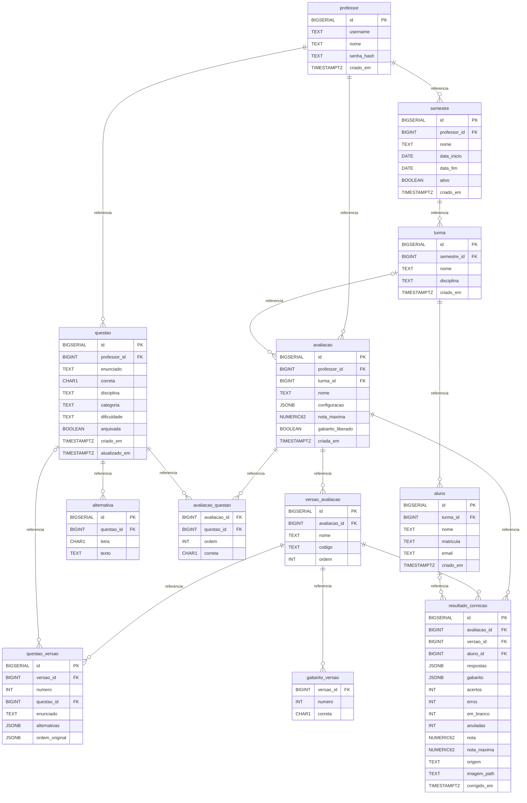

# DER físico — N2-INF-01

Preparação local de Diego em 05/10/2026. Contrato do [PR #45](https://github.com/gabriel-Koehler/projetosgp/pull/45), commit fdb310dac8de60ad10712b79f6fc415aeabe22f2, ainda não integrado à main. A aplicação N1 permanece em memória.

## Integridade e operação

- Chaves compostas: avaliacao_questao(avaliacao_id, questao_id), gabarito_versao(versao_id, numero).
- questao_versao preserva snapshots de enunciado, alternativas e ordem original. Gabaritos são próprios de cada versão.
- Resultado por aluno/avaliação é único quando há aluno identificado.
- RLS habilitada sem policies públicas: usar acesso PostgreSQL pelo servidor com papel adequado. Manter autorização por professor nos repositories/services.
- O contrato original valida relações professor/turma e aluno/versão nos services; revisar constraints compostas após integração.
- IF NOT EXISTS não atualiza tabelas existentes. Aplicar em banco vazio; não usar como migração do schema inglês/UUID anterior.
- Execução DDL/seed e homologação pendentes: PostgreSQL e Docker ausentes no ambiente.
