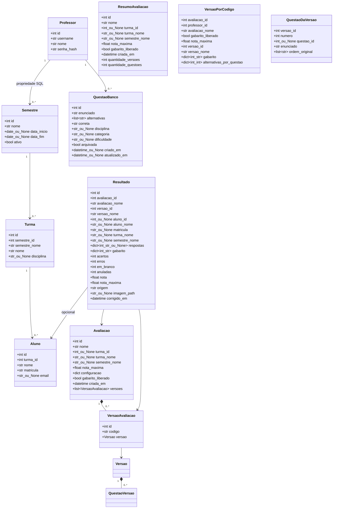

# Diagrama de classes UML v2 — preparação local

Data: 05/10/2026. Campos extraídos dos modelos Python do [PR #45](https://github.com/gabriel-Koehler/projetosgp/pull/45), commit fdb310dac8de60ad10712b79f6fc415aeabe22f2. Essa referência N2 ainda não foi integrada; a main local usa mocks N1.

Fontes: app/models/cadastros.py, avaliacao.py e resultado.py. Métodos hipotéticos do diagrama anterior foram removidos.

## Correspondência e limites

- Professor, Semestre, Turma e Aluno correspondem às tabelas homônimas em minúsculas.
- QuestaoBanco corresponde a questao/alternativa; Avaliacao a avaliacao/avaliacao_questao.
- VersaoAvaliacao/Versao correspondem a versao_avaliacao; QuestaoVersao a questao_versao/gabarito_versao.
- Resultado corresponde a resultado_correcao. ResumoAvaliacao, VersaoPorCodigo e QuestaoDaVersao são projeções de consultas.
- FolhaResposta não é uma classe persistida autônoma nesse contrato: respostas, gabarito e imagem ficam no resultado.
- Core local N1: app/core/version_builder.py possui Questao, ConfiguracaoVersoes, QuestaoVersao, Versao e Nomenclatura. A N2 evolui esse core em app/services/version_builder.py.
- Reconferir após integração dos PRs N2; diagrama não certifica implantação ou homologação N2.
