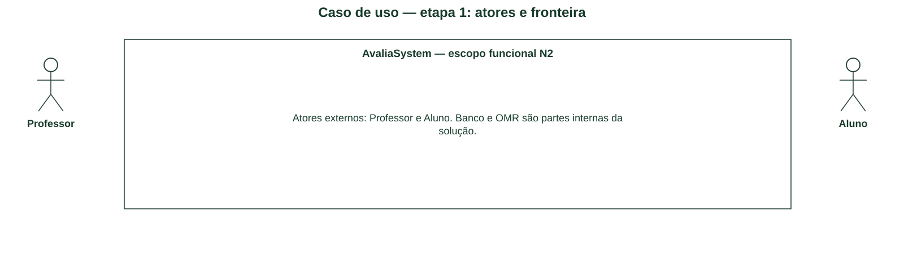
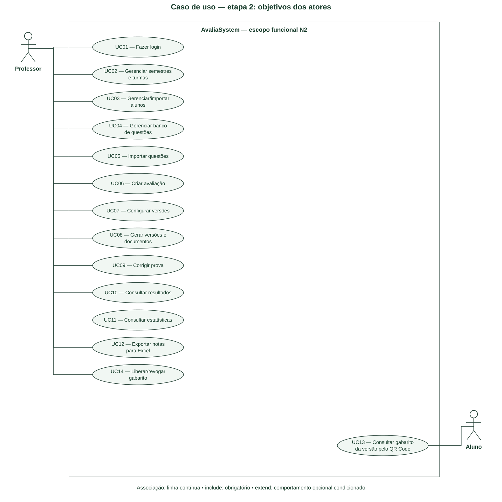
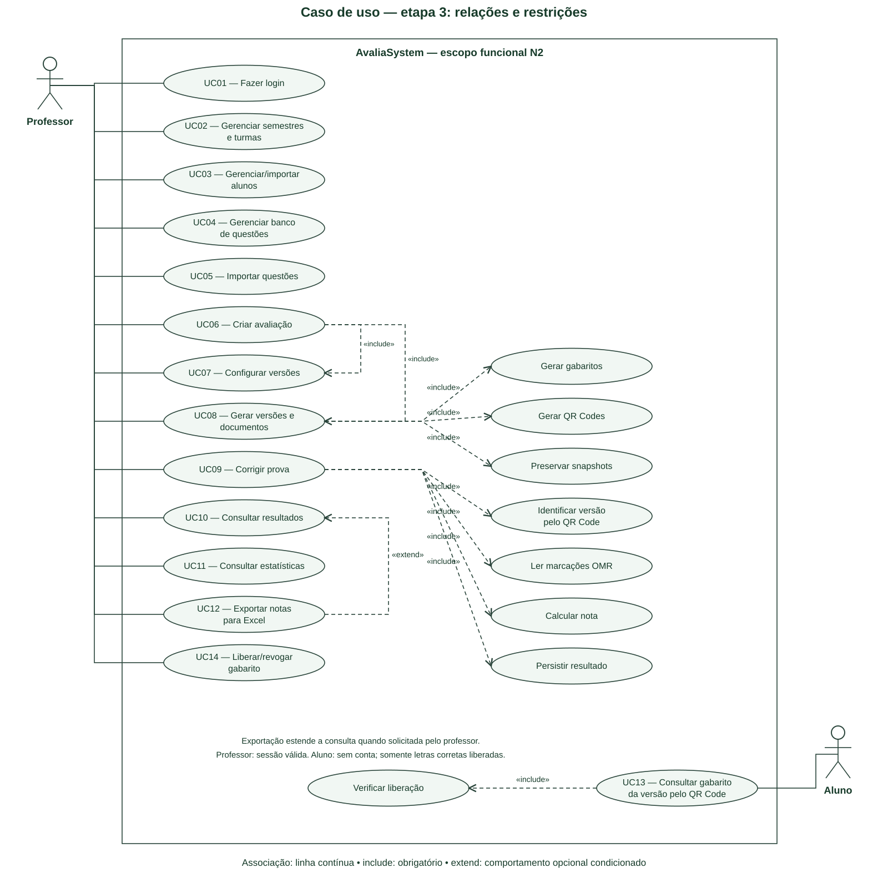

# N2 – Parte 1: Diagrama de Caso de Uso

Este material modela a N2 do AvaliaSystem a partir dos requisitos e artefatos do repositório. Representa o projeto proposto, e não comprova que todos os fluxos já estejam implementados. O arquivo “Exemplo Atividade.md” da aula não foi disponibilizado: conferir sua estrutura antes da entrega. As imagens SVG foram compostas localmente; as fontes PlantUML são editáveis e não foram renderizadas pelo motor PlantUML neste ambiente.

## Passo a passo da criação

### Passo 1 — Delimitar o sistema

Definir a fronteira AvaliaSystem: cadastros, avaliações, versões, correção, resultados e gabaritos. Banco de dados e OMR são componentes internos, não atores externos.

### Passo 2 — Identificar atores

Professor administra seus dados e corrige avaliações. Aluno consulta somente o gabarito liberado; não recebe uma conta nem acesso a notas ou respostas individuais.

[Fonte editável da etapa 1](diagramas/01-caso-uso-etapa-1.puml).

### Passo 3 — Extrair objetivos

Usar UC01–UC12 e UC13 dos fluxos existentes. Acrescentar UC14, liberar/bloquear gabarito, como objetivo explícito do professor extraído da regra de publicação; este novo identificador precisa ser conciliado com o catálogo oficial.

### Passo 4 — Associar atores aos objetivos

Ligar Professor aos cadastros, geração, correção, resultados, estatísticas, exportação e liberação. Ligar Aluno apenas a consultar gabarito. Login é um objetivo próprio e a sessão válida é precondição das operações privadas.

[Fonte editável da etapa 2](diagramas/01-caso-uso-etapa-2.puml).

### Passo 5 — Modelar relações obrigatórias e opcionais

Usar include quando o fluxo necessariamente executa o comportamento incluído: configurar/gerar versões, gerar QR/gabarito/snapshots, identificar QR, ler marcações, calcular e persistir correção, verificar liberação. Usar extend de exportar Excel para consultar resultados sob a condição “exportação solicitada”. As setas include apontam ao comportamento incluído; extend aponta ao caso base.

### Passo 6 — Revisar a fronteira e as regras

Confirmar isolamento por professor, acesso público restrito e ausência de atores técnicos artificiais. Geração é parte do fluxo completo de criação adotado neste modelo; se o grupo separar salvar rascunho de gerar avaliação, deverá retirar o include obrigatório de geração e documentar o novo objetivo.

## Diagrama final

[Abrir imagem](diagramas/01-caso-uso-final.svg) · [Fonte PlantUML](diagramas/01-caso-uso-final.puml).

**Rastreabilidade:** UC01–UC13 em [fluxos de usuário](../requisitos/fluxos-de-usuario.md); UC14 proposto para a liberação. Escopo funcional RF01–RF48. Revisões A02 e A04 do backlog.

**Conferência:** nenhuma consulta pública oferece notas; exportação é opcional; correção exige versão identificada e sessão do professor.

## Referências

- [Requisitos e fluxos do projeto](../requisitos/fluxos-de-usuario.md).
- [Documentação oficial PlantUML](https://plantuml.com/use-case-diagram).
- Exemplo da aula: pendente de disponibilização e conferência.
