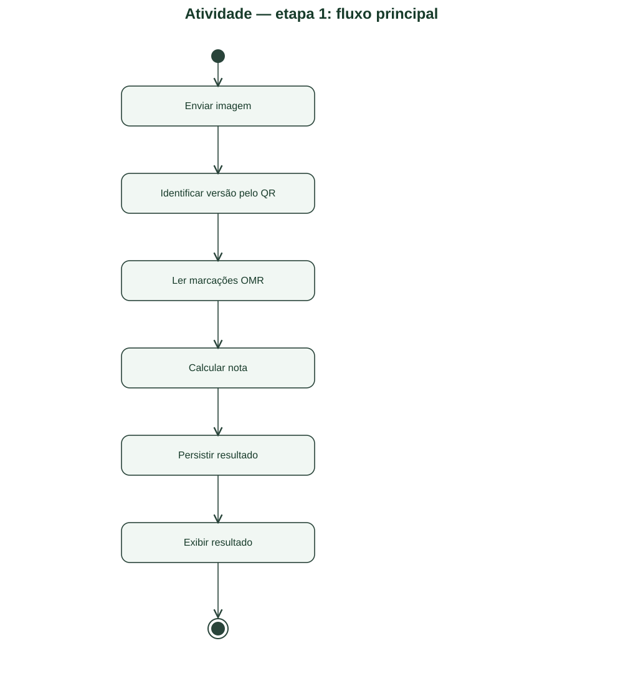
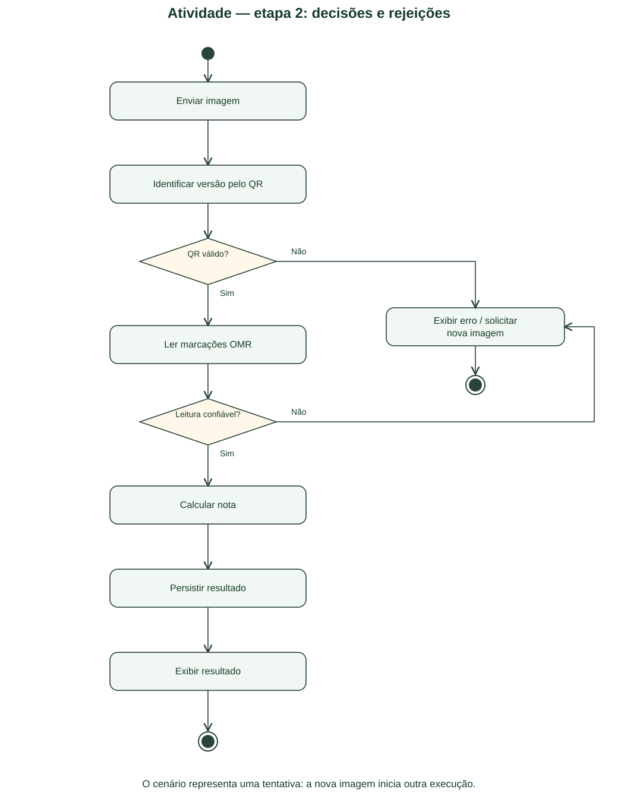
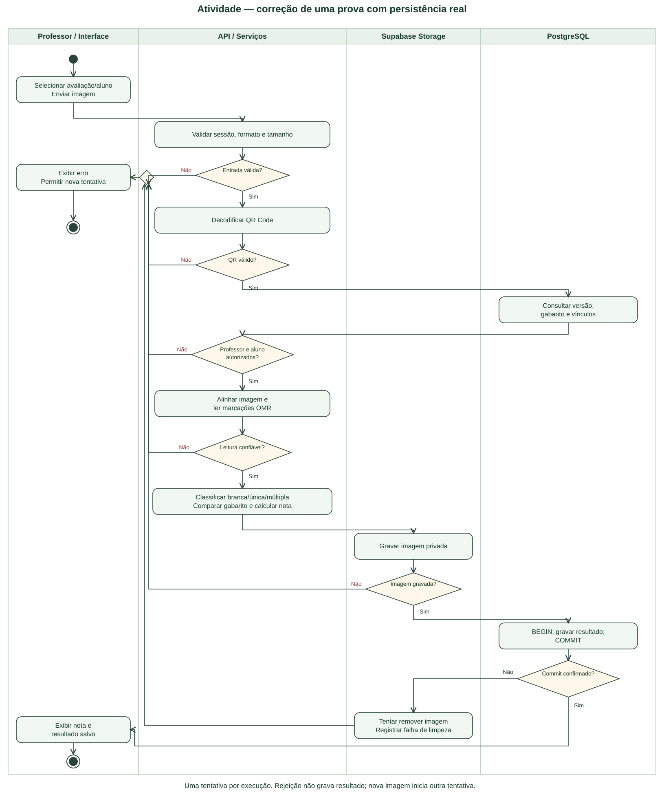

# N2 – Parte 1: Diagrama de Atividade

Este material modela a N2 do AvaliaSystem a partir dos requisitos e artefatos do repositório. Representa o projeto proposto, e não comprova que todos os fluxos já estejam implementados. O arquivo “Exemplo Atividade.md” da aula não foi disponibilizado: conferir sua estrutura antes da entrega. As imagens SVG foram compostas localmente; as fontes PlantUML são editáveis e não foram renderizadas pelo motor PlantUML neste ambiente.

## Passo a passo da criação

### Passo 1 — Escolher um cenário

Modelar UC09: professor seleciona aluno e envia a imagem de uma folha para correção automática. Precondições: sessão válida, avaliação/versão gerada e vínculos pertencentes ao professor.

### Passo 2 — Escrever o fluxo principal

Enviar imagem → identificar versão por QR → ler marcações → calcular nota → persistir → apresentar confirmação. Um diagrama descreve uma tentativa; novo envio inicia outra execução.

[Fonte editável da etapa 1](diagramas/02-atividade-etapa-1.puml).

### Passo 3 — Inserir decisões

Verificar sessão/formato, QR, versão/vínculos autorizados e confiança da leitura. Cada guarda tem saída de sucesso e saída de rejeição explícita; não continuar depois de rejeitar.

### Passo 4 — Distribuir responsabilidades

Usar raias Professor/Interface, API/Serviços, Supabase Storage e PostgreSQL. A interface envia e apresenta; serviços autorizam e corrigem; Storage guarda imagem privada; PostgreSQL mantém versão, snapshot e resultado.

[Fonte editável da etapa 2](diagramas/02-atividade-etapa-2.puml).

### Passo 5 — Detalhar a correção

Classificar marcação simples, em branco e múltipla antes do cálculo. A regra de nota máxima/pesos e o tratamento de anulações devem ser confirmados em E01; baixa confiança na leitura interrompe a tentativa e pede outra imagem.

### Passo 6 — Acrescentar persistência e falhas

Gravar a imagem, iniciar a transação SQL e confirmar resultado somente após COMMIT. Falha de Storage não grava resultado. Falha SQL provoca tentativa de remover a imagem recém-gravada; registrar falha de limpeza e retornar erro. PostgreSQL e Storage não formam uma transação distribuída.

### Passo 7 — Validar caminhos e finais

Percorrer sucesso e cada rejeição desde o início até um final. Um erro não produz mensagem de resultado salvo. Conferir equivalência com o diagrama de sequência.

## Diagrama final

[Abrir imagem](diagramas/02-atividade-final.svg) · [Fonte PlantUML](diagramas/02-atividade-final.puml).

**Rastreabilidade:** UC09; RF31–RF40. Revisões E01, E02 e E08.

**Pós-condição de sucesso:** resultado confirmado e imagem referenciada. **Pós-condição de falha:** não anunciar sucesso; imagem órfã pode exigir limpeza posterior se a compensação falhar.

## Referências

- [Requisitos e fluxos do projeto](../requisitos/fluxos-de-usuario.md).
- [Documentação oficial PlantUML](https://plantuml.com/activity-diagram-beta).
- Exemplo da aula: pendente de disponibilização e conferência.
