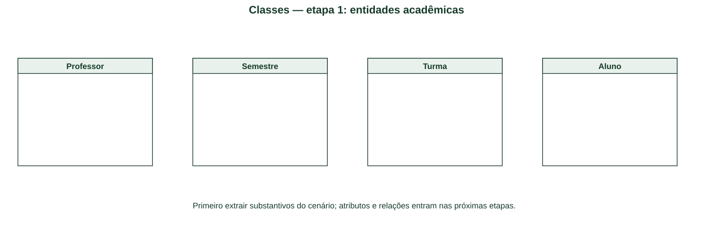
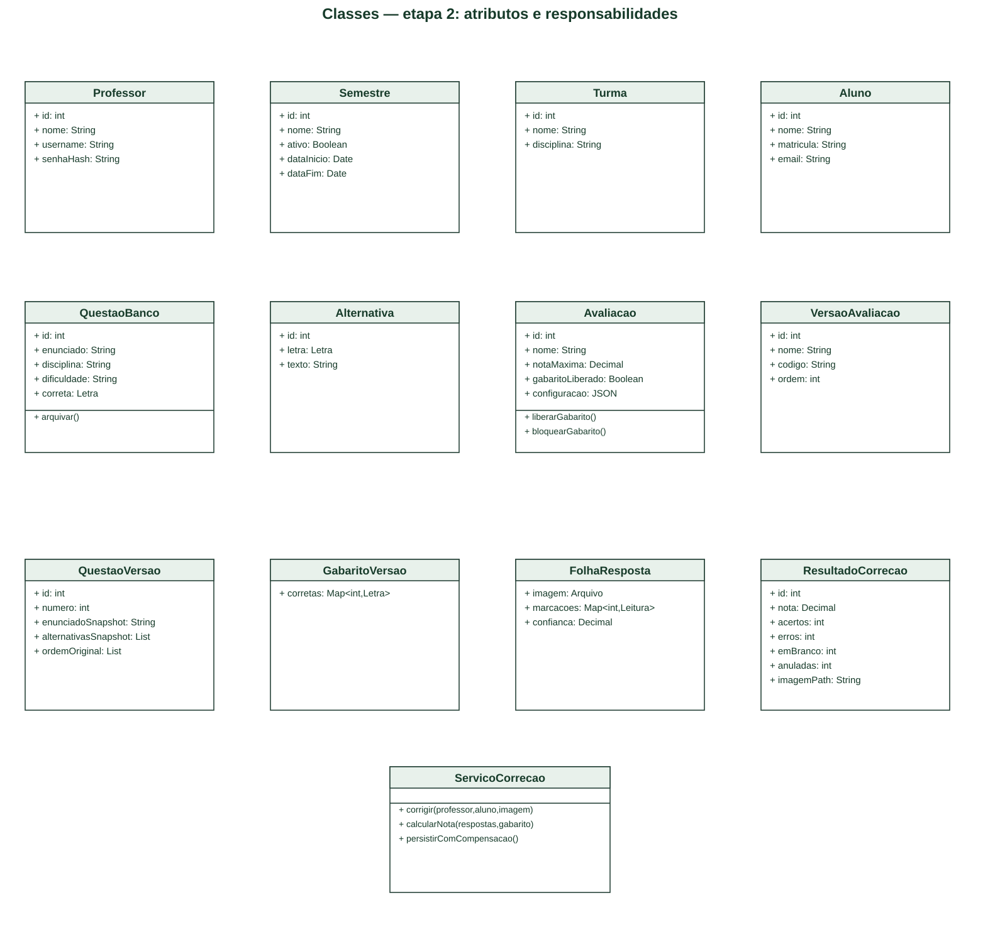
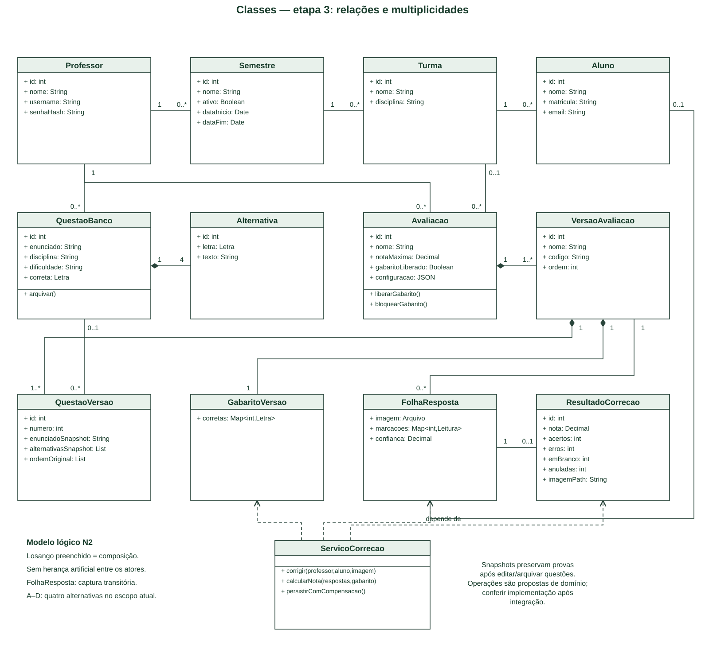

# N2 – Parte 1: Diagrama de Classe

Este material modela a N2 do AvaliaSystem a partir dos requisitos e artefatos do repositório. Representa o projeto proposto, e não comprova que todos os fluxos já estejam implementados. O arquivo “Exemplo Atividade.md” da aula não foi disponibilizado: conferir sua estrutura antes da entrega. As imagens SVG foram compostas localmente; as fontes PlantUML são editáveis e não foram renderizadas pelo motor PlantUML neste ambiente.

## Passo a passo da criação

### Passo 1 — Extrair entidades do cenário

Começar com Professor, Semestre, Turma e Aluno. Acrescentar QuestaoBanco, Alternativa, Avaliacao, VersaoAvaliacao, QuestaoVersao, GabaritoVersao, FolhaResposta e ResultadoCorrecao.

### Passo 2 — Separar dados e responsabilidades

Registrar identidade, vínculos e campos relevantes nos compartimentos de atributos. Introduzir ServicoCorrecao para coordenar leitura, cálculo e persistência com compensação. Métodos exibidos são operações propostas de domínio; não são inventário de métodos já implementados.

[Fonte editável da etapa 1](diagramas/03-classe-etapa-1.puml).

### Passo 3 — Definir associações e multiplicidades

Professor possui zero ou muitos semestres/questões/avaliações; semestre possui turmas; turma possui alunos. Uma avaliação possui uma ou mais versões e cada versão contém questões congeladas e um gabarito.

### Passo 4 — Identificar composição

Usar losango preenchido no lado do todo para alternativas da questão e versões/questões congeladas/gabarito. A composição expressa propriedade no modelo lógico; não autoriza apagar resultados históricos nem equivale automaticamente a ON DELETE CASCADE.

[Fonte editável da etapa 2](diagramas/03-classe-etapa-2.puml).

### Passo 5 — Preservar o histórico

QuestaoVersao é um snapshot: pode conservar o conteúdo com referência original opcional. Editar ou arquivar QuestaoBanco não altera versões já geradas. A versão permanece vinculada à correção utilizada no cálculo.

### Passo 6 — Conciliar modelo e banco

FolhaResposta é uma captura transitória, sem pressupor tabela folha_resposta: imagem e respostas são persistidas em resultado_correcao. GabaritoVersao representa logicamente o gabarito da versão. Turma e aluno opcionais refletem casos permitidos no modelo de dados; o cenário de correção escolhido exige aluno identificado e vínculo válido.

### Passo 7 — Revisar decisões de projeto

Quatro alternativas A–D representam a interface atual; confirmar antes de ampliar para cinco. Nenhuma herança Professor/Aluno foi criada apenas por serem atores. Conferir cardinalidades e mapeamento físico junto ao MER/DER e dicionário de dados.

## Diagrama final

[Abrir imagem](diagramas/03-classe-final.svg) · [Fonte PlantUML](diagramas/03-classe-final.puml).

**Rastreabilidade:** RN14 (snapshots); cadastros, avaliações e correção. Revisões D02, D03, E03 e E04.

**Distinção:** este é um modelo lógico de domínio N2. Consulte também [UML existente](../arquitetura/diagrama-classes-uml-v2.md) e [modelo físico](../../src/database/) para confrontar a implementação. Classes lógicas não exigem uma tabela por classe.

## Referências

- [Requisitos e fluxos do projeto](../requisitos/fluxos-de-usuario.md).
- [Documentação oficial PlantUML](https://plantuml.com/class-diagram).
- Exemplo da aula: pendente de disponibilização e conferência.
