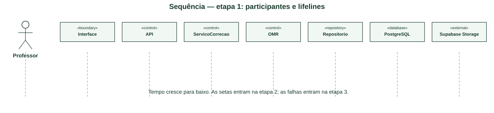
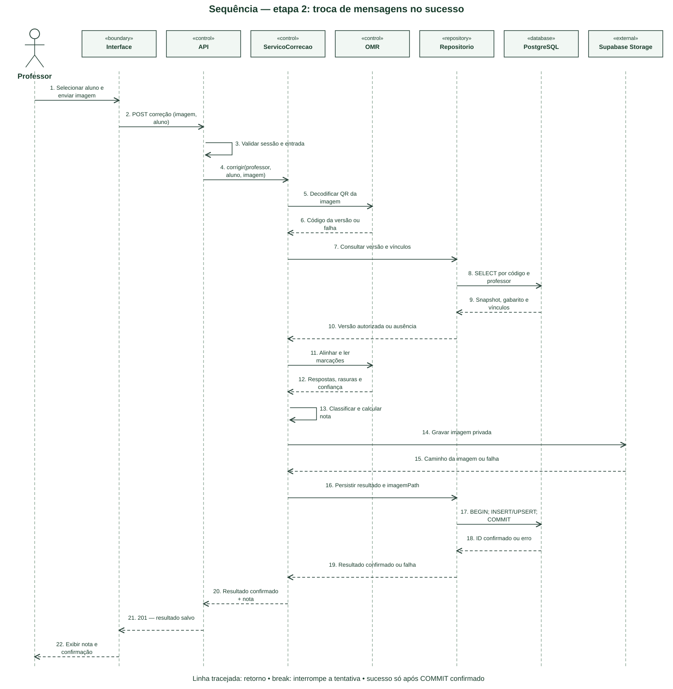
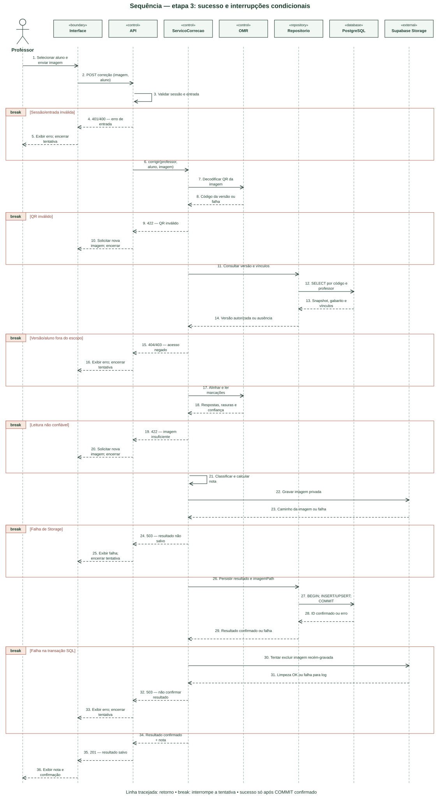

# N2 – Parte 1: Diagrama de Sequência

Este material modela a N2 do AvaliaSystem a partir dos requisitos e artefatos do repositório. Representa o projeto proposto, e não comprova que todos os fluxos já estejam implementados. O arquivo “Exemplo Atividade.md” da aula não foi disponibilizado: conferir sua estrutura antes da entrega. As imagens SVG foram compostas localmente; as fontes PlantUML são editáveis e não foram renderizadas pelo motor PlantUML neste ambiente.

## Passo a passo da criação

### Passo 1 — Escolher a interação

Usar a mesma tentativa de correção UC09 do diagrama de atividade. Registrar precondições e resultado esperado antes de desenhar mensagens.

### Passo 2 — Definir participantes e linhas de vida

Professor → Interface → API → ServicoCorrecao → OMR → Repositorio → PostgreSQL → Supabase Storage. O tempo avança de cima para baixo. Componentes técnicos aqui são participantes da interação, mesmo sem serem atores de caso de uso.

[Fonte editável da etapa 1](diagramas/04-sequencia-etapa-1.puml).

### Passo 3 — Adicionar entrada e autorização

Interface envia imagem/aluno, API valida sessão/entrada e serviço decodifica QR. Repositório consulta versão e vínculos por código e professor antes de corrigir; aluno e versão devem estar no escopo autorizado.

### Passo 4 — Adicionar processamento

OMR alinha a imagem e retorna marcações/confiança; serviço classifica respostas e calcula nota segundo as regras aprovadas. Consultar o snapshot da versão evita usar uma questão posteriormente alterada.

[Fonte editável da etapa 2](diagramas/04-sequencia-etapa-2.puml).

### Passo 5 — Adicionar gravação e retorno

Guardar imagem privada no Storage e persistir resultado por transação SQL. Só retornar resultado confirmado após COMMIT. Setas tracejadas indicam respostas; chamadas ao próprio participante representam processamento interno.

### Passo 6 — Introduzir fragmentos condicionais

Usar break para sessão/entrada inválida, QR inválido, versão/aluno sem autorização, leitura não confiável, falha de Storage e falha SQL. Quando a condição ocorre, o fragmento encerra a tentativa e o restante do cenário de sucesso não é executado.

### Passo 7 — Revisar compensação e coerência

Se SQL falhar depois do upload, tentar excluir a imagem; registrar eventual falha de limpeza. A chamada combinada BEGIN/INSERT ou UPSERT/COMMIT é uma abstração da transação, não uma consulta SQL literal. Conferir mensagens com as raias da atividade e responsabilidades das classes.

## Diagrama final

[Abrir imagem](diagramas/04-sequencia-final.svg) · [Fonte PlantUML](diagramas/04-sequencia-final.puml).

**Rastreabilidade:** UC09; RF31–RF40; RN14. Revisões A03, L07, L08 e E08.

**Contrato proposto:** 400/401 entrada/sessão; 403/404 vínculo/versão; 422 QR/leitura; 503 persistência; 201 sucesso. Confirmar códigos e estratégia INSERT/UPSERT na integração L01/L08; este desenho não comprova contratos atuais.

## Referências

- [Requisitos e fluxos do projeto](../requisitos/fluxos-de-usuario.md).
- [Documentação oficial PlantUML](https://plantuml.com/sequence-diagram).
- Exemplo da aula: pendente de disponibilização e conferência.
