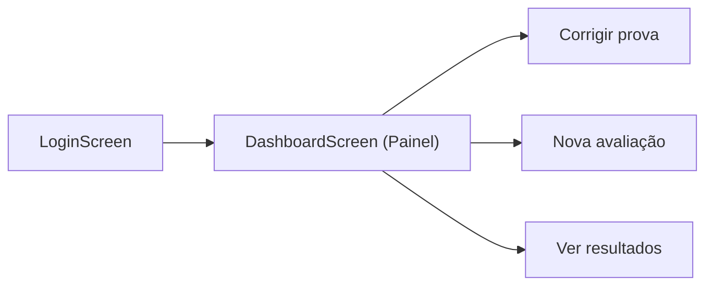
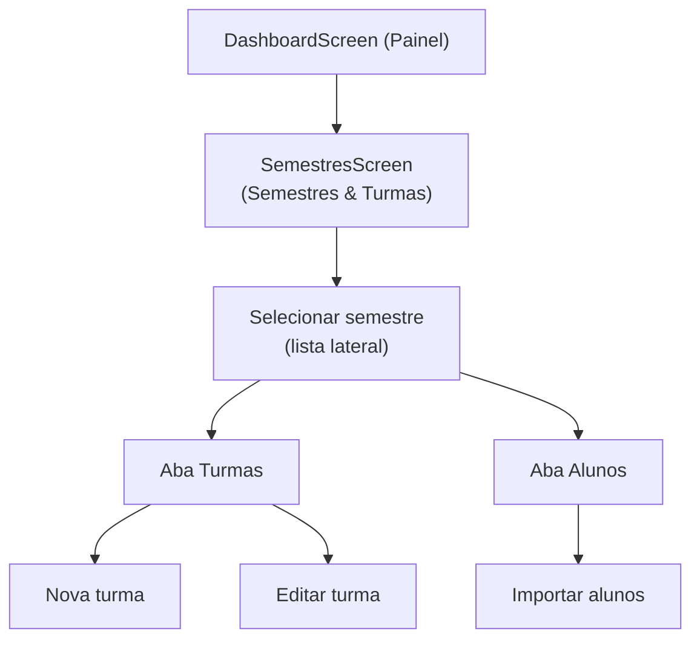
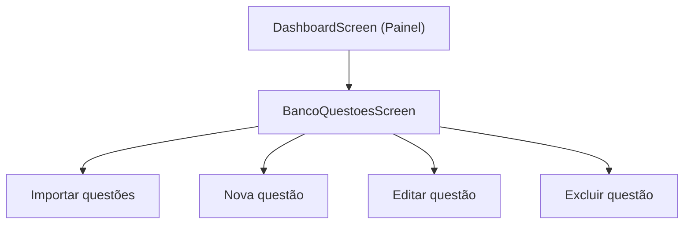
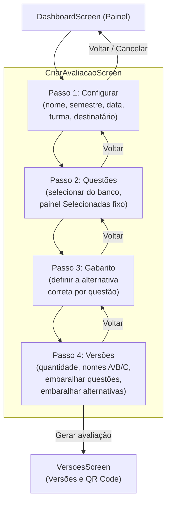
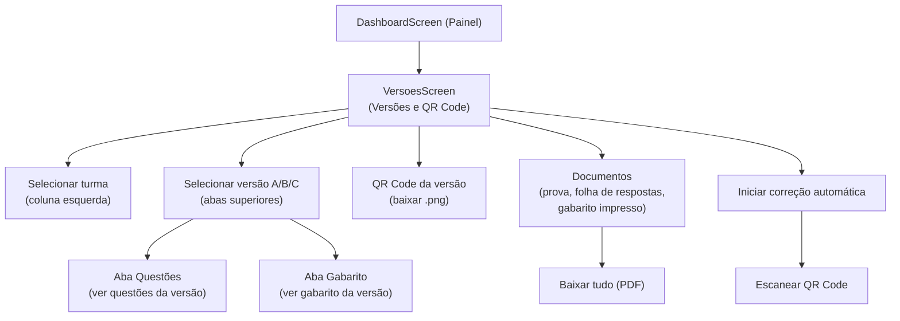
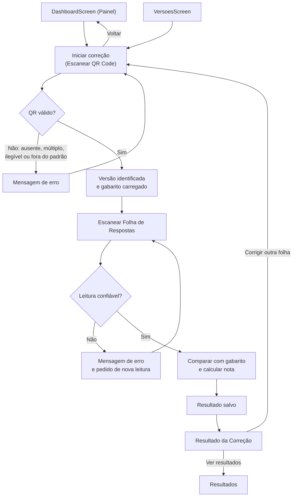
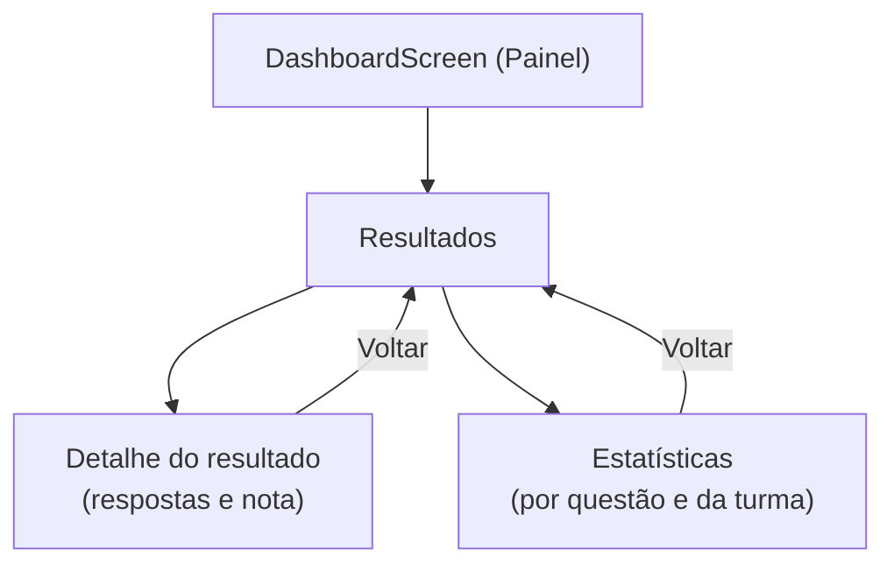
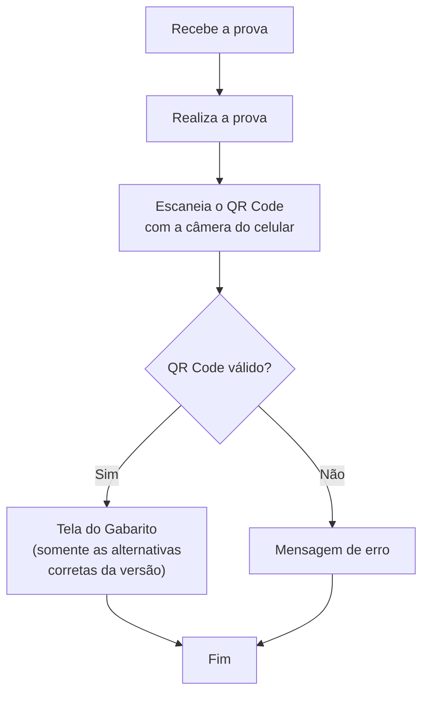

# Fluxos de Usuário e Casos de Uso

**Issue:** N1-REQ-01 (#2) · **Etapa:** N1 – Passo 04 (telas navegáveis)
**Origem:** Seções 9 e 10 do Documento de Requisitos e Escopo, conferidas com o protótipo em Figma (wireframe "AvaliaSystem")
**Responsável:** Eloisa Fazzio da Silva Rocha

---

## 1. Objetivo

Documentar a jornada dos dois perfis do sistema e a regra de navegação entre telas ("a tela A leva à tela B"), garantindo que nenhuma tela fique sem saída ou sem entrada. Os nomes de tela abaixo seguem o protótipo em Figma.

| Perfil | Autenticação | Acesso |
|---|---|---|
| Professor | Sim (único usuário autenticado, RN01) | Todas as funcionalidades administrativas |
| Aluno | Não (sem conta, login ou painel, RN02) | Apenas a consulta do gabarito da sua versão, via QR Code |

---

## 2. Fluxo do Professor (Fluxo 9)

### 2.1 Login e Painel

O Painel mostra estatísticas gerais (questões no banco, provas corrigidas, avaliações criadas, alunos ativos), um gráfico de correções da semana e a lista de avaliações recentes, além dos 3 atalhos acima.

### 2.2 Semestres, Turmas e Alunos

Semestres & Turmas é uma única tela: a coluna esquerda lista os semestres, e a área principal tem abas **Turmas** e **Alunos** para o semestre selecionado.

### 2.3 Banco de Questões

A tela tem busca, filtro por disciplina (coluna esquerda) e a lista de questões com gabarito, dificuldade e ações Ver/Editar/Excluir.

### 2.4 Nova Avaliação (fluxo de 4 passos)

Os 4 passos ficam na mesma tela `CriarAvaliacaoScreen`, com uma barra de progresso (Configurar → Questões → Gabarito → Versões) e um painel **Resumo** fixo na lateral direita.

### 2.5 Versões, QR Code e correção

### 2.6 Correção automática

### 2.7 Resultados

---

## 3. Fluxo do Aluno (Fluxo 10)

O aluno **não** vê respostas marcadas, nota, resultado individual, estatísticas, banco de questões nem área administrativa (RF30, RN03, RN04, RN05). Ele não interage com nenhuma das telas do professor.

---

## 4. Regra de navegação: a tela A leva à tela B

**Regras gerais:** toda tela alcançável tem ao menos uma saída, e toda tela (exceto Login) tem uma entrada. Toda tela do professor tem o menu lateral fixo (Painel, Semestres & Turmas, Banco de Questões, Nova Avaliação, Versões & QR Code, Correção Automática, Resultados, Sair da conta), então qualquer tela pode voltar ao Painel por ali.

| Tela de origem (A) | Ação | Tela de destino (B) |
|---|---|---|
| `LoginScreen` | Entrar com credenciais válidas / "Continuar com o Google" | `DashboardScreen` |
| `DashboardScreen` | Clicar "Corrigir prova" | Escanear QR Code (correção) |
| `DashboardScreen` | Clicar "Nova avaliação" | `CriarAvaliacaoScreen` — Passo 1 |
| `DashboardScreen` | Clicar "Ver resultados" | Resultados |
| `DashboardScreen` | Menu lateral → Semestres & Turmas | `SemestresScreen` |
| `DashboardScreen` | Menu lateral → Banco de Questões | `BancoQuestoesScreen` |
| `DashboardScreen` | Menu lateral → Versões & QR Code | `VersoesScreen` |
| `SemestresScreen` | Selecionar semestre | Atualiza abas Turmas/Alunos |
| `SemestresScreen` (aba Turmas) | "+ Nova turma" / "Editar" | Formulário de turma, depois volta à lista |
| `SemestresScreen` (aba Alunos) | "Importar alunos" | Fluxo de importação (prévia e confirmação), depois volta à lista |
| `BancoQuestoesScreen` | "Nova questão" | Formulário de questão, depois volta ao banco |
| `BancoQuestoesScreen` | "Importar" | Fluxo de importação Excel/CSV, depois volta ao banco |
| `BancoQuestoesScreen` | "Editar" / "Excluir" em uma questão | Volta ao banco atualizado |
| `CriarAvaliacaoScreen` — Passo 1 (Configurar) | "Próxima →" | Passo 2 (Questões) |
| `CriarAvaliacaoScreen` — Passo 2 (Questões) | "Próxima →" | Passo 3 (Gabarito) |
| `CriarAvaliacaoScreen` — Passo 3 (Gabarito) | "Próxima →" | Passo 4 (Versões) |
| `CriarAvaliacaoScreen` — Passo 4 (Versões) | "Gerar avaliação" | `VersoesScreen` |
| `CriarAvaliacaoScreen` (qualquer passo) | "← Voltar" / "← Cancelar" | Passo anterior / `DashboardScreen` |
| `VersoesScreen` | Selecionar turma / versão (A, B, C) | Atualiza questões, gabarito, QR Code e documentos exibidos |
| `VersoesScreen` | "Baixar QR (.png)" / "Baixar tudo (PDF)" | Faz o download (permanece na mesma tela) |
| `VersoesScreen` | "Iniciar correção automática" | Escanear QR Code (correção) |
| Escanear QR Code | QR válido | Escanear Folha de Respostas |
| Escanear QR Code | Falha no QR | Mensagem de erro, volta a Escanear QR Code |
| Escanear Folha de Respostas | Leitura confiável | Resultado da Correção |
| Escanear Folha de Respostas | Leitura duvidosa | Mensagem de erro, volta a Escanear Folha |
| Resultado da Correção | "Corrigir outra folha" | Escanear QR Code |
| Resultado da Correção | "Ver resultados" | Resultados |
| Resultados | Abrir um resultado | Detalhe do resultado |
| Resultados | Ver estatísticas | Estatísticas |
| Detalhe / Estatísticas | Voltar | Resultados |
| Aluno: QR Code escaneado | QR válido | Tela do Gabarito |
| Aluno: QR Code escaneado | QR inválido | Mensagem de erro |

---

## 5. Casos de uso

| ID | Caso de uso | Ator | Requisitos relacionados |
|---|---|---|---|
| UC01 | Fazer login | Professor | RF01, RN01 |
| UC02 | Gerenciar semestres e turmas | Professor | RF02, RF03 |
| UC03 | Gerenciar e importar alunos | Professor | RF04, RF05 |
| UC04 | Cadastrar, editar e excluir questões | Professor | RF06, RF07, RF08, RF09 |
| UC05 | Importar questões por Excel/CSV | Professor | RF10, RF11, RF12, RF13 |
| UC06 | Criar avaliação e selecionar questões | Professor | RF14, RF15, RF16 |
| UC07 | Configurar versões (quantidade, nomes, embaralhamento) | Professor | RF17 a RF22 |
| UC08 | Gerar versões, gabaritos, provas, folhas e QR Codes | Professor | RF23 a RF28 |
| UC09 | Corrigir prova automaticamente | Professor | RF31 a RF40 |
| UC10 | Consultar resultados e notas | Professor | RF41, RF42, RF43 |
| UC11 | Consultar estatísticas | Professor | RF44, RF45, RF46 |
| UC12 | Gerar relatório e exportar para Excel | Professor | RF47, RF48 |
| UC13 | Consultar gabarito da versão via QR Code | Aluno | RF29, RF30, RN03 a RN05 |

---

## 6. Observações

- Na N1 as telas usam dados estáticos/mock, sem conexão com banco de dados (Passo 04 da N1). Os fluxos acima descrevem a navegação, não a persistência.
- Os nomes das telas foram conferidos diretamente no protótipo Figma ("Wireframe das telas principais"): `LoginScreen`, `DashboardScreen`, `SemestresScreen`, `BancoQuestoesScreen`, `CriarAvaliacaoScreen` e `VersoesScreen`.
- A criação de avaliação é um único fluxo de 4 passos numa mesma tela (`CriarAvaliacaoScreen`), não telas separadas — atualizado aqui em relação à primeira versão deste documento.
- Semestres, Turmas e Alunos vivem numa única tela (`SemestresScreen`) com seleção de semestre e abas Turmas/Alunos — também atualizado em relação à primeira versão.
- As telas de correção (escanear QR Code, escanear folha, resultado da correção) não apareciam no trecho do wireframe consultado até este ponto; os nomes de tela para essa parte seguem o texto do documento de requisitos e podem precisar de ajuste fino quando essas telas forem conferidas no Figma.
